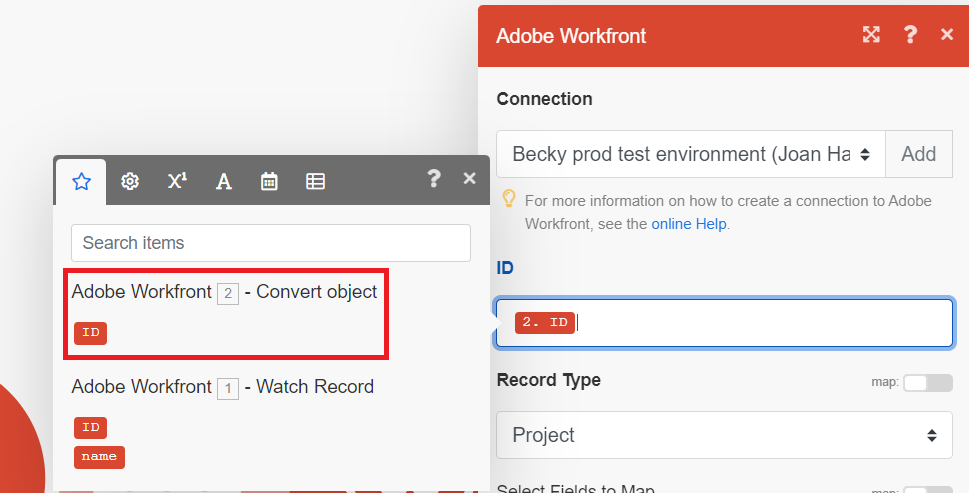

# Utilizzare una funzione per aggiornare un progetto in uno scenario di base

Updating a Workfront work item is a common use case for Workfront Fusion. In this example, you will use a function to change the name of a project to be in uppercase letters.

Fusion include molti tipi di funzioni che consentono di trasformare ed eseguire logica condizionale sui dati. Per ulteriori informazioni sull&#39;utilizzo delle funzioni, vedere [Panoramica delle funzioni](/help/workfront-fusion/get-started-with-fusion/understand-fusion/function-overview.md).

In questo esempio viene modificato lo scenario creato in [Crea uno scenario di base](/help/workfront-fusion/build-practice-scenarios/create-basic-scenario.md).

## Requisiti di accesso

+++ Espandi per visualizzare i requisiti di accesso per la funzionalità descritta in questo articolo.

<table style="table-layout:auto">
 <col> 
 <col> 
 <tbody> 
  <tr> 
   <td role="rowheader">Pacchetto Adobe Workfront</td> 
   <td> 
Qualsiasi pacchetto Workflow di Adobe Workfront, e qualsiasi pacchetto Automation and Integration di Adobe Workfront.

Workfront Ultimate

Pacchetti Workfront Prime e Select, con un ulteriore acquisto di Workfront Fusion.
 </td> 
  </tr> 
  <tr data-mc-conditions=""> 
   <td role="rowheader">Licenze Adobe Workfront</td> 
   <td> 
Standard

Work o successiva
 </td> 
  </tr> 
  <tr> 
   <td role="rowheader">Prodotto</td> 
   <td>
   
Se la tua organizzazione dispone di un pacchetto Workfront Select o Prime che non include Workfront Automation and Integration, dovrà acquistare Adobe Workfront Fusion.</li></ul>
   </td> 
  </tr>
 </tbody> 
</table>

Per ulteriori dettagli sulle informazioni contenute in questa tabella, consulta [Requisiti di accesso nella documentazione](/help/workfront-fusion/references/licenses-and-roles/access-level-requirements-in-documentation.md).

+++

## Prerequisiti

È necessario creare lo scenario descritto in [Creare uno scenario di base](/help/workfront-fusion/build-practice-scenarios/create-basic-scenario.md) prima di seguire questa procedura.

## Utilizzare una funzione per aggiornare un progetto

### Add the Update Record module to your scenario

1. Open the scenario in the scenario editor.
1. Hover over the partial circle to the right of the of the second module, then click **[!UICONTROL Add another module]**.
1. Select Adobe Workfront from the list of applications, then choose the module **[!UICONTROL Update Record]**.
1. In the ID field, select the ID block that is under the Convert object module. Questo è l&#39;ID del progetto generato da quel modulo.

   

1. Nel campo Tipo di record selezionare Progetto, poiché l&#39;oggetto da aggiornare è un progetto.
1. Nell&#39;area Seleziona campi da mappare selezionare Nome.

   Viene aperto un campo Nome.
1. Continua a [Mappare la funzione per l&#39;aggiornamento del nome](#map-the-function-for-the-name-update).

### Mappa la funzione per l’aggiornamento del nome

Quando questo scenario converte una richiesta in un progetto, il nome del progetto è uguale alla richiesta. The function here takes that name and capitalizes all of the letters in it.

1. Click the **Name** field.

   The mapping panel opens.
1. In the mapping panel, click the **Text and binary functions** icon. 
1. Selezionare la funzione **upper**.

   La funzione viene visualizzata nel campo Nome, inclusa la formattazione dell&#39;input previsto.

   L’input per questo esempio è il nome del problema da cui è stato convertito il progetto.

1. Spostare il cursore tra le parentesi, perché è qui che andrà l&#39;input.
1. Nel pannello di mappatura, fai clic sull&#39;icona **Output modulo**. 
1. Select the name block that was output by your first module.

   The name block appears in the function.

   

1. Click **OK** to save the module settings.

### Test and activate

1. Verificare lo scenario facendo clic su **Esegui una volta** nell&#39;angolo inferiore sinistro della schermata.
1. Esamina l’output per garantire che lo scenario sia stato eseguito come previsto.
1. When you are satisfied that the scenario is working as expected, click the **Scheduling** toggle in the lower-left of the screen to **On**.

   This activates the scenario. Active scenarios run according to the schedule set in the trigger module.
1. In Workfront Fusion, click **[!UICONTROL Save]** near the lower-left corner to save your progress on the scenario.

   >[!IMPORTANT]
   >
   >Risparmia spesso quando affili e testa uno scenario. Per attivare lo scenario, potrebbe essere necessario creare un nuovo problema nell’account Workfront.

## Risorse

* [Mappare gli elementi utilizzando le funzioni incorporate](/help//workfront-fusion/create-scenarios/map-data/map-using-functions.md)
