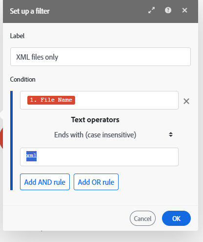

# Aggiungere un filtro a uno scenario

In alcuni scenari, devi lavorare solo con bundle che soddisfano criteri specifici. I filtri ti consentono di selezionare tali bundle.

Ad esempio, è possibile creare uno scenario con il trigger [!UICONTROL Watch records] per [!DNL Workfront] per acquisire solo le attività assegnate a un utente specifico.

Puoi aggiungere un filtro tra due moduli e verificare se i bundle ricevuti dai moduli precedenti soddisfano specifiche condizioni del filtro:

* In caso affermativo, i bundle passano al modulo successivo nello scenario.
* In caso contrario, l’elaborazione dei bundle termina.

## Requisiti di accesso

+++ Espandi per visualizzare i requisiti di accesso per la funzionalità in questo articolo.

Per utilizzare le funzionalità di questo articolo, è necessario disporre dei seguenti diritti di accesso:

<table style="table-layout:auto">
 <col> 
 <col> 
 <tbody> 
  <tr> 
   <td role="rowheader">[!DNL Adobe Workfront] pacchetto</td> 
   <td> 
Qualsiasi
 </td> 
  </tr> 
  <tr data-mc-conditions=""> 
   <td role="rowheader">[!DNL Adobe Workfront] licenza</td> 
   <td> 
Nuovo: [!UICONTROL Standard]

Oppure

Corrente: [!UICONTROL Work] o versione successiva
 </td> 
  </tr> 
  <tr> 
   <td role="rowheader">[!DNL Adobe Workfront Fusion] licenza**</td> 
   <td>
   
Corrente: nessun requisito di licenza [!DNL Workfront Fusion].

   
Oppure

   
Legacy: qualsiasi 

   </td> 
  </tr> 
  <tr> 
   <td role="rowheader">Prodotto</td> 
   <td>
   
Nuovo:
 <ul><li>[!UICONTROL Select] o [!UICONTROL Prime] [!DNL Workfront] piano: l'organizzazione deve acquistare [!DNL Adobe Workfront Fusion].</li><li>[!UICONTROL Ultimate] [!DNL Workfront] piano: [!DNL Workfront Fusion] incluso.</li></ul>
   
Oppure

   
Corrente: la tua organizzazione deve acquistare [!DNL Adobe Workfront Fusion].

   </td> 
  </tr>
 </tbody> 
</table>

Per ulteriori dettagli sulle informazioni contenute in questa tabella, vedere [Requisiti di accesso nella documentazione](/help/workfront-fusion/references/licenses-and-roles/access-level-requirements-in-documentation.md).

Per informazioni sulle [!DNL Adobe Workfront Fusion] licenze, vedere [[!DNL Adobe Workfront Fusion] licenze](/help/workfront-fusion/set-up-and-manage-workfront-fusion/licensing-operations-overview/license-automation-vs-integration.md).

+++

## Prerequisiti

È necessario aggiungere entrambi i moduli a uno scenario prima di poter aggiungere un filtro tra di essi.

## Aggiungi un filtro tra due moduli:

1. Fare clic sulla scheda **[!UICONTROL Scenarios]** nel pannello a sinistra.
1. Seleziona lo scenario in cui desideri aggiungere un filtro.
1. Fai clic in un punto qualsiasi dello scenario per accedere all’editor scenario.
1. Fai clic sull&#39;icona chiave inglese  tra i moduli in cui desideri aggiungere un filtro e seleziona **Configura filtro**.
1. Nella casella visualizzata, immettere **[!UICONTROL Label]** per il filtro.
1. Definire il filtro **[!UICONTROL Condition]**.

   Immettere il campo in base al quale si desidera filtrare nel primo campo, l&#39;operatore e, se necessario, il valore con cui si desidera confrontare il campo.

   >[!TIP]
   >
   >Puoi immettere valori nei campi filtro dal pannello di mappatura
   >Per ulteriori informazioni sulla mappatura, vedere [Mappare le informazioni da un modulo all&#39;altro](/help/workfront-fusion/create-scenarios/map-data/map-data-from-one-to-another.md).

   Ad esempio, se si desidera che il filtro passi i file in [!DNL Adobe Workfront] che termina con XML, immettere **[!UICONTROL File name]** nella prima casella e .**[!UICONTROL xml]** nella seconda casella. Nel menu a discesa tra di essi, selezionare **[!UICONTROL Ends with (case insensitive)]**. Questo filtro si applica ai bundle in arrivo dal primo modulo (Workfront). Solo i bundle contenenti file XML vengono trasferiti al modulo successivo.

   

1. Fare clic su **[!DNL OK]**.

## Copiare un filtro

Attualmente, l’editor dello scenario include una funzione per copiare un filtro.

>[!NOTE]
>
>Se copi i moduli su entrambi i lati del filtro, viene copiato anche il filtro.
>
>Per ulteriori informazioni sulla copia dei moduli, vedere [Copiare moduli o scenari in [!DNL Adobe Workfront Fusion]](/help/workfront-fusion/create-scenarios/add-modules/copy-modules-or-scenarios.md).

Per copiare un filtro senza copiare i moduli, potete utilizzare Fusion DevTool

1. Fare clic sulla scheda **[!UICONTROL Scenarios]** nel pannello a sinistra.
1. Seleziona lo scenario in cui desideri aggiungere un filtro.
1. Fai clic in un punto qualsiasi dello scenario per accedere all’editor scenario.
1. Aprire Fusion DevTool facendo clic sull&#39;icona DevTool  nella parte inferiore dello schermo.

   Se l&#39;icona DevTool non è visibile, vedere [Eseguire il debug di uno scenario](/help/workfront-fusion/manage-scenarios/debug-a-scenario.md) per istruzioni sull&#39;apertura di DevTool.

1. Fare clic sull&#39;icona **[!UICONTROL Tools]**  nella barra laterale sinistra.

1. Fai clic su **[!UICONTROL Copy Filter]**, quindi configura lo strumento **[!UICONTROL Copy Filter]** nel pannello a destra:

   1. Imposta **[!UICONTROL Source Module]** come modulo direttamente dopo il filtro che desideri copiare.
   1. Imposta **[!UICONTROL Target Module]** come modulo dopo il quale vuoi inserire il filtro.

1. Fare clic su **[!UICONTROL Run]**.
