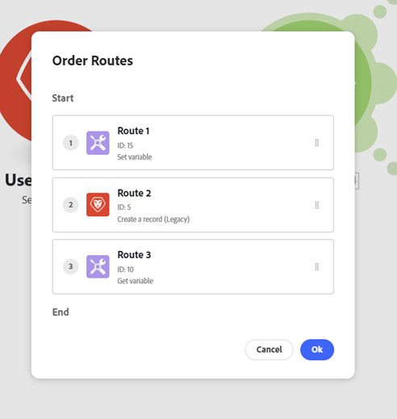

# Aggiungere un modulo router e configurare le route

Il modulo Router consente di suddividere lo scenario in più route ed elaborare i dati all&#39;interno di ciascuna route in modo diverso. Quando un modulo Router riceve un bundle, lo inoltra a ogni route connessa nell&#39;ordine in cui le route sono state collegate al modulo Router.

Le route vengono elaborate in sequenza, non in parallelo. Un bundle viene inviato alla route successiva solo dopo che è stato completamente elaborato dalla route precedente.

## Requisiti di accesso

+++ Espandi per visualizzare i requisiti di accesso per la funzionalità in questo articolo.

Per utilizzare le funzionalità di questo articolo, è necessario disporre dei seguenti diritti di accesso:

<table style="table-layout:auto">
 <col> 
 <col> 
 <tbody> 
  <tr> 
   <td role="rowheader">[!DNL Adobe Workfront] pacchetto</td> 
   <td> 
Qualsiasi
 </td> 
  </tr> 
  <tr data-mc-conditions=""> 
   <td role="rowheader">[!DNL Adobe Workfront] licenza</td> 
   <td> 
Nuovo: [!UICONTROL Standard]

Oppure

Corrente: [!UICONTROL Work] o versione successiva
 </td> 
  </tr> 
  <tr> 
   <td role="rowheader">[!DNL Adobe Workfront Fusion] licenza**</td> 
   <td>
   
Corrente: nessun requisito di licenza [!DNL Workfront Fusion].

   
Oppure

   
Legacy: qualsiasi 

   </td> 
  </tr> 
  <tr> 
   <td role="rowheader">Prodotto</td> 
   <td>
   
Nuovo:
 <ul><li>Piano [!UICONTROL Select] o [!UICONTROL Prime] [!DNL Workfront]: l'organizzazione deve acquistare [!DNL Adobe Workfront Fusion].</li><li>Il piano [!UICONTROL Ultimate] [!DNL Workfront]: [!DNL Workfront Fusion] è incluso.</li></ul>
   
Oppure

   
Corrente: la tua organizzazione deve acquistare [!DNL Adobe Workfront Fusion].

   </td> 
  </tr>
 </tbody> 
</table>

Per ulteriori dettagli sulle informazioni contenute in questa tabella, vedere [Requisiti di accesso nella documentazione](/help/workfront-fusion/references/licenses-and-roles/access-level-requirements-in-documentation.md).

Per informazioni sulle [!DNL Adobe Workfront Fusion] licenze, vedere [[!DNL Adobe Workfront Fusion] licenze](/help/workfront-fusion/set-up-and-manage-workfront-fusion/licensing-operations-overview/license-automation-vs-integration.md).

+++

## Aggiungere un modulo router a uno scenario

È necessario aggiungere un modulo Router prima di configurare i percorsi.

1. Fai clic sulla scheda **[!UICONTROL Scenari]** nel pannello a sinistra.
1. Selezionare lo scenario in cui aggiungere un router.
1. Fai clic in un punto qualsiasi dello scenario per accedere all’editor scenario.
1. Nell’editor dello scenario, fai clic sull’handle destro del modulo dopo il quale desideri aggiungere il router.
1. Selezionare **[!UICONTROL Controllo flusso]** > **Router** nell&#39;elenco dei moduli visualizzati.

   

   Oppure

   Per inserire il modulo Router tra due moduli, fare clic sull&#39;icona chiave inglese sotto la route che collega i due moduli e selezionare **[!UICONTROL Aggiungi un router]** dal menu.

   
1. Aggiungere la prima route al router facendo clic sull&#39;handle destro del router e aggiungendo un modulo simile all&#39;aggiunta di qualsiasi modulo.
1. Per aggiungere un&#39;altra route, fare clic sul modulo router. Viene visualizzata una route. Aggiungere i moduli a questa route come desiderato.

   È possibile aggiungere tutte le route desiderate.

1. Per verificare l&#39;ordine delle route, fare clic sull&#39;icona Allineamento automatico .

   Le route sono disposte nell&#39;ordine in cui vengono eseguite. La route superiore viene eseguita per prima.

1. (Facoltativo) Per modificare l&#39;ordine di instradamento, fare clic con il pulsante destro del mouse sul modulo Router e selezionare **Ordina instradamenti** Trascinare e rilasciare i instradamenti nell&#39;ordine in cui si desidera che vengano eseguiti. Le route sono contrassegnate dal primo modulo che segue il router (il primo modulo della route).

   

1. Continuare con [Aggiungere un filtro a una route](#add-a-filter-to-a-route).

## Aggiungere un filtro a un ciclo di lavorazione

Puoi inserire un filtro su un percorso dopo il modulo Router per filtrare i bundle. Solo i bundle che passano attraverso il filtro verranno gestiti dai moduli sulla route.

Se i dati passano il filtro di più route, i dati vengono gestiti da entrambe le route. La route superiore gestisce prima i dati.

1. Fai clic sulla scheda **[!UICONTROL Scenari]** nel pannello a sinistra.
1. Seleziona lo scenario in cui desideri aggiungere un filtro.
1. Fai clic in un punto qualsiasi dello scenario per accedere all’editor scenario.
1. Fare clic sull&#39;icona chiave inglese  nel percorso in cui si desidera impostare un filtro. Percorso tra il modulo router e il primo modulo della route.
1. Seleziona **Configura un filtro.**
1. Nel campo etichetta del pannello visualizzato, aggiungi un’etichetta. Questa etichetta viene visualizzata nello scenario.
1. Configurare le condizioni del filtro.

   Per ulteriori informazioni, vedere [Aggiungere un filtro a uno scenario](/help/workfront-fusion/create-scenarios/add-modules/add-a-filter-to-a-scenario.md).

1. Fare clic su **[!UICONTROL OK]** per salvare la configurazione del filtro.

1. Continua con [Configurare una route di fallback](#configure-a-fallback-route).

## Configurare una route di fallback

La route di fallback è la route che viene eseguita su tutti i bundle che non passano alcun filtro a un&#39;altra route.

Puoi abilitare una route di fallback nel pannello dei filtri.

1. Fai clic sulla scheda **[!UICONTROL Scenari]** nel pannello a sinistra.
1. Selezionare lo scenario in cui si desidera aggiungere una route di fallback.
1. Fai clic in un punto qualsiasi dello scenario per accedere all’editor scenario.
1. Fare clic sull&#39;icona chiave inglese  nel percorso in cui si desidera impostare un filtro. Percorso tra il modulo router e il primo modulo della route.
1. Seleziona **Configura un filtro.**
1. Nel campo etichetta del pannello visualizzato, aggiungi un’etichetta. Questa etichetta viene visualizzata nello scenario.
1. Abilitare la casella di controllo della route di fallback.

   

1. Fare clic su **[!UICONTROL OK]** per salvare la configurazione del filtro.

La route di fallback è contrassegnata da una freccia diversa nel modulo Router:

## Esempio: `if/else` caso d&#39;uso

>[!BEGINSHADEBOX]

Un caso d’uso tipico della route di fallback consiste nel continuare il flusso con una route se la condizione è soddisfatta e con un’altra route se non lo è. come nei seguenti passaggi:

In questo esempio, la prima route è configurata con un filtro. Rappresenta il componente `if`.

La seconda route è configurata come route di fallback. Rappresenta il componente `else`.

>[!ENDSHADEBOX]
