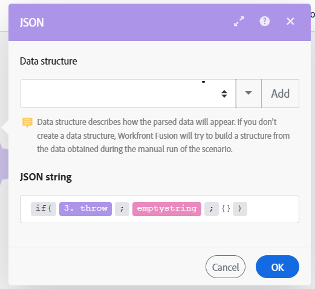

# Configura soluzione alternativa `throw`

In alcuni casi, può essere utile interrompere forzatamente l’esecuzione dello scenario seguita dalla fase di rollback o commit oppure interrompere l’elaborazione di una route e, facoltativamente, memorizzarla nella coda di esecuzioni incomplete.

Attualmente, le direttive di gestione degli errori non possono essere utilizzate al di fuori dell’ambito di una route di gestore degli errori e Adobe Workfront Fusion non offre un modulo che consentirebbe di generare (generare) errori in modo semplice e condizionale.

È possibile utilizzare la seguente soluzione alternativa per simulare la funzionalità di errore `throw`.

Per informazioni sulle esecuzioni incomplete, vedere [Visualizzare e risolvere le esecuzioni incomplete in Adobe Workfront Fusion](/help/workfront-fusion/manage-scenarios/view-and-resolve-incomplete-executions.md).

Per informazioni sulle direttive per la gestione degli errori, vedere [Direttive per la gestione degli errori in Adobe Workfront Fusion](/help/workfront-fusion/references/errors/directives-for-error-handling.md).

## Requisiti di accesso

+++ Espandi per visualizzare i requisiti di accesso per la funzionalità in questo articolo.

Per utilizzare le funzionalità di questo articolo, è necessario disporre dei seguenti diritti di accesso:

<table style="table-layout:auto">
 <col> 
 <col> 
 <tbody> 
  <tr> 
   <td role="rowheader">Pacchetto Adobe Workfront 
   <td> 
Qualsiasi
 </td> 
  </tr> 
  <tr data-mc-conditions=""> 
   <td role="rowheader">Licenza Adobe Workfront</td> 
   <td> 
Nuovo: Standard

Oppure

Corrente: Lavoro o versione successiva
 </td> 
  </tr> 
  <tr> 
   <td role="rowheader">Licenza Adobe Workfront Fusion**</td> 
   <td>
   
Corrente: nessun requisito di licenza Workfront Fusion

   
Oppure

   
Legacy: qualsiasi 

   </td> 
  </tr> 
  <tr> 
   <td role="rowheader">Prodotto</td> 
   <td>
   
Novità:
 <ul><li>Selezionare o Prime Workfront Plan: l'organizzazione deve acquistare Adobe Workfront Fusion.</li><li>Piano Ultimate Workfront: Workfront Fusion è incluso.</li></ul>
   
Oppure

   
Corrente: la tua organizzazione deve acquistare Adobe Workfront Fusion.

   </td> 
  </tr>
 </tbody> 
</table>

Per ulteriori dettagli sulle informazioni contenute in questa tabella, vedere [Requisiti di accesso nella documentazione](/help/workfront-fusion/references/licenses-and-roles/access-level-requirements-in-documentation.md).

Per informazioni sulle licenze di Adobe Workfront Fusion, vedere [Licenze di Adobe Workfront Fusion](/help/workfront-fusion/set-up-and-manage-workfront-fusion/licensing-operations-overview/license-automation-vs-integration.md).

+++

## Soluzione alternativa per `throw`

Per generare un errore in modo condizionale, puoi configurare un modulo in modo che, durante il suo funzionamento, abbia intenzionalmente esito negativo. È possibile utilizzare il modulo [!UICONTROL JSON] > [!UICONTROL Analizza JSON], configurato per generare facoltativamente un errore (`BundleValidationError` in questo caso):

È quindi possibile allegare una delle direttive di gestione degli errori al percorso di gestione degli errori:

* **Rollback**: forza l&#39;interruzione dell&#39;esecuzione dello scenario ed esegue la fase di rollback.
* **Commit**: forza l&#39;arresto dell&#39;esecuzione dello scenario ed esegue la fase di commit.
* **Ignora**: arresta l&#39;elaborazione di una route.
* **Interruzione**: arresta l&#39;elaborazione di una route e la archivia nella coda della cartella esecuzioni incomplete.

Nell&#39;esempio seguente viene illustrato l&#39;utilizzo della direttiva [!DNL Rollback]:

