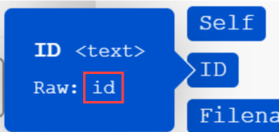

# Mappare un elemento array o array

Un array è un elemento bundle che può contenere i seguenti elementi:

* Uno o più valori dello stesso tipo (array semplice)
* Una o più raccolte dello stesso tipo (array complesso)

>[!BEGINSHADEBOX]

**Esempio:**

* **Array complesso**: il modulo [!UICONTROL Watch emails] restituisce un array di allegati per ogni e-mail. Ogni allegato rappresenta una raccolta che può contenere un nome, contenuto, dimensioni e così via.

>[!ENDSHADEBOX]

## Requisiti di accesso

+++ Espandi per visualizzare i requisiti di accesso per la funzionalità in questo articolo.

Per utilizzare le funzionalità di questo articolo, è necessario disporre dei seguenti diritti di accesso:

<table style="table-layout:auto">
 <col> 
 <col> 
 <tbody> 
  <tr> 
   <td role="rowheader">[!DNL Adobe Workfront] pacchetto</td> 
   <td> 
Qualsiasi
 </td> 
  </tr> 
  <tr data-mc-conditions=""> 
   <td role="rowheader">[!DNL Adobe Workfront] licenza</td> 
   <td> 
Nuovo: [!UICONTROL Standard]

Oppure

Corrente: [!UICONTROL Work] o versione successiva
 </td> 
  </tr> 
  <tr> 
   <td role="rowheader">[!DNL Adobe Workfront Fusion] licenza**</td> 
   <td>
   
Corrente: nessun requisito di licenza [!DNL Workfront Fusion].

   
Oppure

   
Legacy: qualsiasi 

   </td> 
  </tr> 
  <tr> 
   <td role="rowheader">Prodotto</td> 
   <td>
   
Nuovo:
 <ul><li>[!UICONTROL Select] o [!UICONTROL Prime] [!DNL Workfront] piano: l'organizzazione deve acquistare [!DNL Adobe Workfront Fusion].</li><li>[!UICONTROL Ultimate] [!DNL Workfront] piano: [!DNL Workfront Fusion] incluso.</li></ul>
   
Oppure

   
Corrente: la tua organizzazione deve acquistare [!DNL Adobe Workfront Fusion].

   </td> 
  </tr>
 </tbody> 
</table>

Per ulteriori dettagli sulle informazioni contenute in questa tabella, vedere [Requisiti di accesso nella documentazione](/help/workfront-fusion/references/licenses-and-roles/access-level-requirements-in-documentation.md).

Per informazioni sulle [!DNL Adobe Workfront Fusion] licenze, vedere [[!DNL Adobe Workfront Fusion] licenze](/help/workfront-fusion/set-up-and-manage-workfront-fusion/licensing-operations-overview/license-automation-vs-integration.md).

+++

## Mappare un intero array

1. Fare clic sulla scheda **[!UICONTROL Scenarios]** nel pannello a sinistra.
1. Selezionare lo scenario in cui si desidera mappare un array.
1. Fai clic in un punto qualsiasi dello scenario per accedere all’editor scenario.
1. Nel modulo a cui si desidera mappare l’array, fare clic sul campo in cui si desidera mappare l’array. Questo è il campo a cui è mappato l’array.

1. Nella casella visualizzata, mappa l’elemento.

   Il pannello consente di mappare i campi allo stesso modo di qualsiasi altro tipo di elemento. Se non si desidera compilare ogni elemento separatamente, ma si desidera mappare un altro array nel campo di destinazione, utilizzare il pulsante [!UICONTROL Map]. In questo caso, assicurarsi che entrambe le matrici (l&#39;array di origine e l&#39;array di destinazione) abbiano la stessa struttura.

   È possibile aggiungere un numero qualsiasi di elementi a un array.

Potete dividere una matrice in singoli bundle utilizzando un iteratore. Per ulteriori informazioni, vedere il modulo [[!UICONTROL Iterator] in [!DNL Adobe Workfront Fusion]](/help/workfront-fusion/references/modules/iterator-module.md).

## Mappare gli elementi in un nuovo array

Alcuni campi in Workfront Fusion consentono di mappare gli elementi in un array. Ad esempio, puoi creare un array di elementi dell’elenco di controllo nel modulo Schede di Workfront > Aggiungi elemento dell’elenco di controllo. Quando il modulo viene eseguito, tutte le voci dell’elenco di controllo vengono aggiunte alla scheda.

Qualsiasi campo modulo che mostra &quot;Aggiungi elemento&quot; crea un array.

Per aggiungere elementi all’array:

1. Fai clic su **Aggiungi elemento**
1. Nel pannello visualizzato, immetti i dettagli dell’elemento.
1. Fare clic su **Aggiungi**.
1. (Facoltativo) Ripetere i passaggi 1-3 per ogni elemento che si desidera aggiungere all&#39;array .

## Mappare gli elementi dell’array

### Mappare gli elementi array per numero

Gli elementi array vengono visualizzati sotto forma di numero tra parentesi quadre dopo il nome dell’array. Puoi mappare un singolo elemento di un array in un campo utilizzando questo numero di indice.

>[!NOTE]
>
>L’indicizzazione degli array in Workfront Fusion inizia da 1.

Per mappare un elemento array:

1. Fai clic sul campo in cui desideri mappare l’elemento.

   Viene visualizzato il pannello di mappatura.

1. Individua l’array che contiene l’elemento da mappare.
1. Fai clic sulla freccia a discesa accanto all’array.
1. Fai clic sull’elemento da mappare.

   L’elemento viene mappato, con l’indice pari a 1. Viene mappato il primo elemento dell’array.

1. Per mappare un elemento diverso dell&#39;array, fare clic su [1] e immettere il numero di indice dell&#39;elemento dell&#39;array da mappare.

   

### Mappare l’elemento di un array con una determinata chiave

Alcuni array contengono raccolte con elementi chiave come metadati, attributi e così via. Per utilizzare uno di questi valori, puoi cercare un elemento in base al valore chiave dato e ottenere il valore corrispondente dall’elemento valore. È consigliabile utilizzare una formula che utilizza una combinazione delle funzioni `map()` e `get()`.

>[!BEGINSHADEBOX]

Nell&#39;esempio seguente viene illustrato l&#39;output dell&#39;app [!DNL Jira].

Questo esempio ottiene un nome di file da un array di allegati, per l’allegato specifico con un ID di 10108.

Questo esempio genera il seguente output:

La formula può essere spiegata come segue:

* `map`

   1. Il primo parametro della funzione `map()` è l&#39;intero elemento dell&#39;array.
   1. Il secondo parametro è il nome non elaborato dell&#39;elemento valore. Per ottenere il nome non elaborato, passa il cursore del mouse sull&#39;elemento nel pannello [!UICONTROL mapping]:

      

      >[!NOTE]
      >
      >Tutti i parametri fanno distinzione tra maiuscole e minuscole. Anche se in questo particolare esempio l’etichetta dell’elemento differisce dal suo nome non elaborato solo in maiuscolo, è necessario utilizzare il nome non elaborato.

   1. Il terzo parametro è il nome non elaborato dell’elemento chiave:

      

   1. Il quarto parametro è il valore chiave specificato.

  Poiché la funzione `map()` restituisce un array (poiché potrebbero essere presenti più elementi con il valore chiave specificato), è necessario applicare la funzione `get()` per ottenere il primo elemento:

* `get`

   1. Il primo parametro della funzione `get()` è il risultato della funzione `map()`.

   1. Il secondo parametro rappresenta l&#39;indice dell&#39;elemento. In questo esempio, l&#39;indice è `1`.

Questo esempio genera il seguente output:

>[!ENDSHADEBOX]

Per ulteriori informazioni sulla funzione `map()`, vedere [Funzioni array](/help/workfront-fusion/references/mapping-panel/functions/array-functions.md).

Per ulteriori informazioni sulla funzione `get()`, vedere [Funzioni generali](/help/workfront-fusion/references/mapping-panel/functions/general-functions.md).

## Convertire elementi array in una serie di bundle

Gli array possono essere convertiti in una serie di bundle utilizzando il modulo [!UICONTROL Iterator]. Per ulteriori informazioni, vedere il modulo [[!UICONTROL Iterator]](/help/workfront-fusion/references/modules/iterator-module.md).

