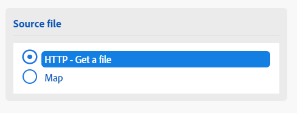
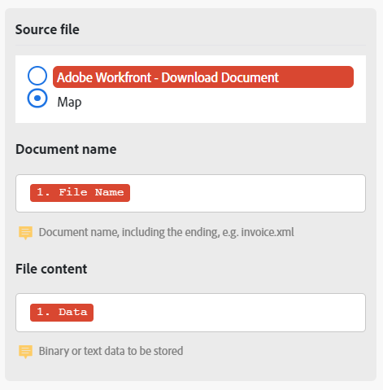

# Mappare un file tra moduli

Alcuni moduli possono elaborare i file. Questi moduli possono restituire un file di output da inviare per l&#39;ulteriore elaborazione o richiedere che venga passato un file per l&#39;elaborazione. È possibile mappare i file in modo che un output di file di un modulo possa essere elaborato da un altro modulo.

## Requisiti di accesso

+++ Espandi per visualizzare i requisiti di accesso per la funzionalità descritta in questo articolo.

<table style="table-layout:auto">
 <col> 
 <col> 
 <tbody> 
  <tr> 
   <td role="rowheader">Pacchetto Adobe Workfront</td> 
   <td> 
Qualsiasi pacchetto Workflow di Adobe Workfront, e qualsiasi pacchetto Automation and Integration di Adobe Workfront.

Workfront Ultimate

Pacchetti Workfront Prime e Select, con un ulteriore acquisto di Workfront Fusion.
 </td> 
  </tr> 
  <tr data-mc-conditions=""> 
   <td role="rowheader">Licenze Adobe Workfront</td> 
   <td> 
Standard

Work o successiva
 </td> 
  </tr> 
  <tr> 
   <td role="rowheader">Prodotto</td> 
   <td>
   
Se la tua organizzazione dispone di un pacchetto Workfront Select o Prime che non include Workfront Automation and Integration, dovrà acquistare Adobe Workfront Fusion.</li></ul>
   </td> 
  </tr>
 </tbody> 
</table>

Per ulteriori dettagli sulle informazioni contenute in questa tabella, consulta [Requisiti di accesso nella documentazione](/help/workfront-fusion/references/licenses-and-roles/access-level-requirements-in-documentation.md).

+++

## Mappare i file dai moduli di origine ai moduli di destinazione

I moduli possono elaborare file che richiedono due informazioni:

* Nome file
* Contenuto file (dati)

Se uno dei moduli precedenti genera un file, è possibile selezionare il modulo di origine e il nome e i dati dell&#39;output di file di tale modulo vengono mappati al modulo di destinazione.

Puoi anche immettere manualmente questo nome e questi dati o mapparli dai moduli precedenti. Ciò può risultare utile, ad esempio, quando si rinomina un file.

>[!NOTE]
>
>Se devi elaborare un file da un URL, ti consigliamo di utilizzare il modulo `HTTP > Get a File` per scaricare il file dall&#39;URL e quindi di mappare il file dal modulo `HTTP > Get a File` al campo del modulo desiderato nel tuo scenario.
>
>

Per mappare un file:

1. Fai clic sulla scheda **[!UICONTROL Scenari]** nel pannello a sinistra.
1. Selezionare lo scenario in cui si desidera mappare un file.
1. Fai clic in un punto qualsiasi dello scenario per accedere all’editor scenario.
1. Nel modulo di destinazione, che è la destinazione a cui si sta eseguendo il mapping, individuare l&#39;area **file Source**.
1. Per mappare l&#39;output di un file di un modulo precedente, selezionare il modulo che restituisce il file.

   

1. Per mappare il nome e i dati manualmente, selezionare Mappa, quindi immettere o mappare il nome e i dati del file.

   

1. Continuare la configurazione del modulo oppure fare clic su **OK**.
