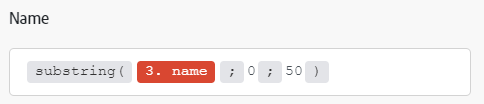
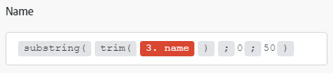
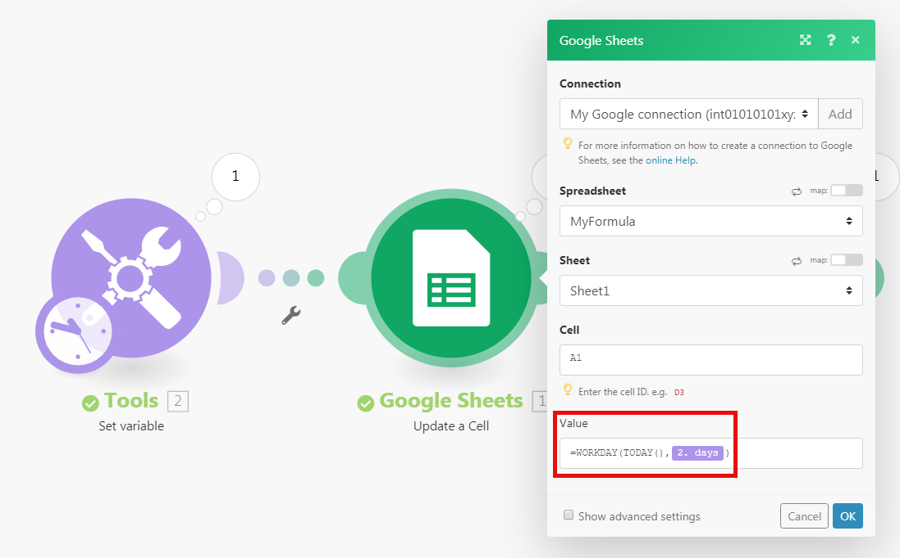

# Map an item using built-in functions

Workfront Fusion include funzioni incorporate che consentono di creare formule semplici o complesse. Queste funzioni coprono un&#39;ampia varietà di casi d&#39;uso, tra cui funzioni per array, stringhe, numeri e dati dei moduli precedenti.

Inoltre, puoi creare funzioni personalizzate che gli scenari possono utilizzare per trasformare e manipolare i dati.

For information and instructions on custom functions, see [Map data using custom functions](/help/workfront-fusion/create-scenarios/map-data/map-using-custom-functions.md).

## Requisiti di accesso

+++ Espandi per visualizzare i requisiti di accesso per la funzionalità descritta in questo articolo.

<table style="table-layout:auto">
 <col> 
 <col> 
 <tbody> 
  <tr> 
   <td role="rowheader">Pacchetto Adobe Workfront</td> 
   <td> 
Qualsiasi pacchetto Workflow di Adobe Workfront, e qualsiasi pacchetto Automation and Integration di Adobe Workfront.

Workfront Ultimate

Pacchetti Workfront Prime e Select, con un ulteriore acquisto di Workfront Fusion.
 </td> 
  </tr> 
  <tr data-mc-conditions=""> 
   <td role="rowheader">Licenze Adobe Workfront</td> 
   <td> 
Standard

Work o successiva
 </td> 
  </tr> 
  <tr> 
   <td role="rowheader">Prodotto</td> 
   <td>
   
<ul><li>Se la tua organizzazione dispone di un pacchetto Workfront Select o Prime che non include Workfront Automation and Integration, dovrà acquistare Adobe Workfront Fusion.</li><li>You must have an Adobe App Builder license to use custom functions.</ul>
   </td> 
  </tr>
 </tbody> 
</table>

Per ulteriori dettagli sulle informazioni contenute in questa tabella, consulta [Requisiti di accesso nella documentazione](/help/workfront-fusion/references/licenses-and-roles/access-level-requirements-in-documentation.md).

+++

## Map data using built-in functions

Durante la mappatura degli elementi, puoi utilizzare funzioni per la creazione di formule semplici o complesse. Le funzioni disponibili sono simili a quelle presenti in Excel e in alcuni linguaggi di programmazione:

* Queste valutano la logica generale, la matematica, il testo, le date e gli array.
* Consentono di eseguire logica condizionale e trasformazioni dei valori degli elementi, ad esempio la conversione di un testo in maiuscolo, il ritaglio del testo, la conversione di una data in un formato diverso e altro ancora.

### Insert functions into fields

To insert a function into a field:

1. Click the **[!UICONTROL Scenarios]** tab in the left panel.
1. Select the scenario where you want to map data.
1. Click anywhere on the scenario to enter the Scenario editor.
1. Click the field where you want to insert a function.
1. Select the tab in the mapping panel that contains the function you want to insert.

   For information on mapping panel tabs, see [Function overview](/help/workfront-fusion/get-started-with-fusion/understand-fusion/function-overview.md)
1. Click the function name.

   Oppure

   Drag the function into the field.
1. Configure the function parameters.

   For an explanation of function parameters, hover over the function in the mapping panel.

   For more information on functions and their parameters, see the articles under [Function references: article index](/help/workfront-fusion/references/mapping-panel/functions/functions-toc.md).

1. Continue configuring the module, or click **OK**.

>[!TIP]
>
>When you create a complex formula that you want to reuse in another field, you can click the field that contains the combination, use Cmd-A or Ctrl-A to select it, then copy and paste it into the other field.

>[!BEGINSHADEBOX]

**Example:** Some data types prevent users from entering more than a certain number of characters. You can use the substring function to limit a value to a certain number of characters.

In questo esempio, la funzione di sottostringa limita il nome del progetto a 50 caratteri.

>[!ENDSHADEBOX]

### Nidificazione delle funzioni

È possibile nidificare le funzioni l&#39;una nell&#39;altra.

>[!BEGINSHADEBOX]

**Esempio:**

In questo esempio, la funzione di sottostringa limita il nome del progetto tagliato a 50 caratteri.

>[!ENDSHADEBOX]

Per nidificare una funzione:

1. Fare clic sul campo in cui si sta creando una formula.

   Viene aperto il pannello di mappatura.

1. Fare clic sulla prima funzione che si desidera aggiungere. Questa è la funzione all&#39;esterno. Nell&#39;esempio seguente, questa è la funzione `substring`.
1. In tale funzione, fare clic nel punto in cui si desidera spostare la funzione nidificata. In questo esempio, la funzione nidificata sostituisce il primo parametro.
1. Nel pannello di mappatura, fai clic sulla funzione nidificata. In questo esempio, questa è la funzione `trim`.
1. Continuare a configurare la funzione come desiderato.
1. Continuare la configurazione del modulo oppure fare clic su **OK**.

### Utilizza le funzioni [!DNL Google Sheets]

Se Workfront Fusion non include una funzione che si desidera utilizzare, ma è disponibile in [!DNL Google Sheets], è possibile utilizzarla seguendo la procedura seguente:

1. In [!DNL Google Sheets] creare un nuovo foglio di calcolo vuoto.
1. Apri lo scenario in Workfront Fusion.
1. Aggiungi il modulo **[!DNL Google Sheets]** >**[!UICONTROL Aggiorna cella]** allo scenario.

1. Configura il modulo:

   1. Scegliere il nuovo foglio di calcolo creato nel campo **[!UICONTROL Foglio di calcolo]**.
   1. Insert your formula containing the [!DNL Google Sheets] function(s) into the **[!UICONTROL Value]** field.

      You can use the output of preceding modules as usual.

      

1. Insert the **[!UICONTROL Google Sheets] >[!UICONTROL Get a cell]** module to obtain the calculated result.
1. Configure the module, using the same Cell ID that you used in step 4.

   
