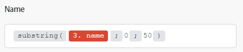

# Mappare un elemento utilizzando le funzioni

Quando mappate gli elementi, potete utilizzare le funzioni per creare formule semplici o complesse. Le funzioni disponibili sono simili a quelle disponibili in Excel e in alcuni linguaggi di programmazione:

* Valutano logica generale, matematica, testo, date e array.
* Consentono di eseguire logica condizionale e trasformazioni dei valori degli elementi, ad esempio la conversione di un testo in maiuscolo, il ritaglio del testo, la conversione di una data in un formato diverso e altro ancora.

## Requisiti di accesso

+++ Espandi per visualizzare i requisiti di accesso per la funzionalità in questo articolo.

Per utilizzare le funzionalità di questo articolo, è necessario disporre dei seguenti diritti di accesso:

<table style="table-layout:auto">
 <col> 
 <col> 
 <tbody> 
  <tr> 
   <td role="rowheader">[!DNL Adobe Workfront] pacchetto</td> 
   <td> 
Qualsiasi
 </td> 
  </tr> 
  <tr data-mc-conditions=""> 
   <td role="rowheader">[!DNL Adobe Workfront] licenza</td> 
   <td> 
Nuovo: [!UICONTROL Standard]

Oppure

Corrente: [!UICONTROL Work] o versione successiva
 </td> 
  </tr> 
  <tr> 
   <td role="rowheader">[!DNL Adobe Workfront Fusion] licenza**</td> 
   <td>
   
Corrente: nessun requisito di licenza [!DNL Workfront Fusion].

   
Oppure

   
Legacy: qualsiasi 

   </td> 
  </tr> 
  <tr> 
   <td role="rowheader">Prodotto</td> 
   <td>
   
Nuovo:
 <ul><li>[!UICONTROL Select] o [!UICONTROL Prime] [!DNL Workfront] piano: l'organizzazione deve acquistare [!DNL Adobe Workfront Fusion].</li><li>[!UICONTROL Ultimate] [!DNL Workfront] piano: [!DNL Workfront Fusion] incluso.</li></ul>
   
Oppure

   
Corrente: la tua organizzazione deve acquistare [!DNL Adobe Workfront Fusion].

   </td> 
  </tr>
  <tr data-mc-conditions=""> 
   <td role="rowheader">Configurazioni del livello di accesso*</td> 
   <td> 
     
Devi essere un amministratore [!DNL Workfront Fusion] per la tua organizzazione.

     
Devi essere un amministratore [!DNL Workfront Fusion] per il tuo team.

   </td> 
  </tr> 
   </td> 
  </tr> 
 </tbody> 
</table>

Per ulteriori dettagli sulle informazioni contenute in questa tabella, vedere [Requisiti di accesso nella documentazione](/help/workfront-fusion/references/licenses-and-roles/access-level-requirements-in-documentation.md).

Per informazioni sulle [!DNL Adobe Workfront Fusion] licenze, vedere [[!DNL Adobe Workfront Fusion] licenze](/help/workfront-fusion/set-up-and-manage-workfront-fusion/licensing-operations-overview/license-automation-vs-integration.md).

+++

## Inserisci funzioni nei campi

Per inserire una funzione in un campo:

1. Fare clic sulla scheda **[!UICONTROL Scenarios]** nel pannello a sinistra.
1. Seleziona lo scenario in cui desideri mappare i dati.
1. Fai clic in un punto qualsiasi dello scenario per accedere all’editor scenario.
1. Fare clic sul campo in cui si desidera inserire una funzione.
1. Selezionare la scheda nel pannello di mappatura contenente la funzione che si desidera inserire.

   Per informazioni sulle schede del pannello di mappatura, vedi [Panoramica delle funzioni](/help/workfront-fusion/get-started-with-fusion/understand-fusion/function-overview.md)
   1. Fare clic sul nome della funzione.

      Oppure

      Trascina la funzione nel campo.
1. Configura i parametri della funzione.

   Per una spiegazione dei parametri di funzione, passa il cursore sulla funzione nel pannello di mappatura.

   Per ulteriori informazioni sulle funzioni e i relativi parametri, vedere gli articoli in [Riferimenti alle funzioni: article index](/help/workfront-fusion/references/mapping-panel/functions/functions-toc.md).

1. Continuare la configurazione del modulo oppure fare clic su **OK**.

>[!TIP]
>
>Quando si crea una formula complessa che si desidera riutilizzare in un altro campo, è possibile fare clic sul campo che contiene la combinazione, utilizzare Cmd-A o Ctrl-A per selezionarla, quindi copiarla e incollarla nell&#39;altro campo.

>[!BEGINSHADEBOX]

**Esempio:** alcuni tipi di dati impediscono agli utenti di immettere più di un determinato numero di caratteri. Puoi utilizzare la funzione di sottostringa per limitare un valore a un determinato numero di caratteri.

In questo esempio, la funzione di sottostringa limita il nome del progetto a 50 caratteri.

>[!ENDSHADEBOX]

## Nidificazione delle funzioni

È possibile nidificare le funzioni l&#39;una nell&#39;altra.

>[!BEGINSHADEBOX]

**Esempio:**

In questo esempio, la funzione di sottostringa limita il nome del progetto tagliato a 50 caratteri.

>[!ENDSHADEBOX]

Per nidificare una funzione:

1. Fare clic sul campo in cui si sta creando una formula.

   Viene aperto il pannello di mappatura.

1. Fare clic sulla prima funzione che si desidera aggiungere. Questa è la funzione all&#39;esterno. Nell&#39;esempio seguente, questa è la funzione `substring`.
1. In tale funzione, fare clic nel punto in cui si desidera spostare la funzione nidificata. In questo esempio, la funzione nidificata sostituisce il primo parametro.
1. Nel pannello di mappatura, fai clic sulla funzione nidificata. In questo esempio, questa è la funzione `trim`.
1. Continuare a configurare la funzione come desiderato.
1. Continuare la configurazione del modulo oppure fare clic su **OK**.

## Utilizza le funzioni [!DNL Google Sheets]

Se [!DNL Workfront Fusion] non include una funzione che si desidera utilizzare, ma è disponibile in [!DNL Google Sheets], è possibile utilizzarla eseguendo la procedura seguente:

1. In [!DNL Google Sheets] creare un nuovo foglio di calcolo vuoto.
1. In [!DNL Workfront Fusion], apri lo scenario.
1. Aggiungi il modulo **[!DNL Google Sheets]** >**[!UICONTROL Update a cell]** allo scenario.

1. Configura il modulo:

   1. Scegliere il nuovo foglio di calcolo creato nel campo **[!UICONTROL Spreadsheet]**.
   1. Inserire la formula contenente le funzioni [!DNL Google Sheets] nel campo **[!UICONTROL Value]**.

      Puoi utilizzare come di consueto l’output dei moduli precedenti.

      

1. Inserire il modulo **[!UICONTROL Google Sheets]>[!UICONTROL Get a cell]** per ottenere il risultato calcolato.
1. Configura il modulo utilizzando lo stesso ID cella utilizzato nel passaggio 4.

   
