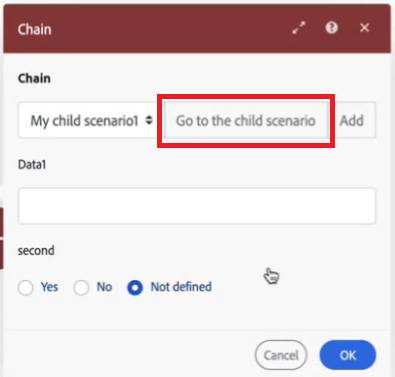

# Catena più scenari insieme

Puoi concatenare gli scenari, consentendo a uno di attivarne un altro e restituendo l’output di dati dal secondo al primo. Questo consente di creare scenari più modulari, senza dover duplicare sezioni di scenari in più scenari.

È possibile chiamare più scenari figlio da uno scenario padre e uno scenario figlio da più scenari padre. Puoi anche nidificare scenari secondari, effettuando una chiamata da un altro.

Quando uno scenario padre è in attesa che uno scenario figlio restituisca i dati, tale tempo non viene conteggiato rispetto al timeout dello scenario padre. Ad esempio, uno scenario principale chiama 5 scenari secondari, ciascuno dei quali richiede 10 minuti per essere eseguito, per un totale di 50 minuti. L’esecuzione dei moduli nello scenario principale richiede 15 minuti. Lo scenario principale non va in timeout, anche se sono trascorsi in totale 65 minuti, ossia oltre il limite di timeout di 40 minuti.

Per ulteriori informazioni sui guardrail delle prestazioni di Fusion, inclusi i timeout, vedere [Guardrail delle prestazioni di Fusion](/help/workfront-fusion/references/scenarios/fusion-performance-guardrails.md).

Per istruzioni sulla configurazione dei moduli Chain, vedere [Moduli Chain](/help/workfront-fusion/references/apps-and-modules/tools-and-transformers/chain-modules.md).

## Scenari padre e figlio

* Lo scenario **parent** chiama un altro scenario utilizzando il modulo **Chain** > **Call a child scenario**. Riceve l’output dello scenario figlio, che può elaborare nei moduli di scenario successivi.
* Lo scenario **figlio** è chiamato dallo scenario padre. Il relativo modulo trigger riceve i dati dallo scenario padre e restituisce l&#39;output allo scenario padre.

Lo scenario padre richiede una risposta dallo scenario figlio. Gli scenari secondari che non restituiscono dati non sono attualmente supportati.

## Strutture di dati in scenari concatenati

Workfront Fusion utilizza le strutture di dati per trasferire le informazioni dallo scenario padre allo scenario figlio. La struttura dati è configurata nello scenario figlio. Quando lo scenario figlio viene selezionato dallo scenario padre, i campi per la struttura dati utilizzata come input dello scenario figlio vengono visualizzati nello scenario padre. Puoi mappare i valori su questi campi, che vengono passati allo scenario secondario quando viene attivato.

Per informazioni sui moduli da configurare negli scenari padre e figlio, vedere [Moduli catena](/help/workfront-fusion/references/apps-and-modules/tools-and-transformers/chain-modules.md).

Per informazioni sulle strutture dati, vedere [Strutture dati](/help/workfront-fusion/references/mapping-panel/data-types/data-structures.md).

## Flusso di dati

1. I dati scorrono attraverso lo scenario principale.
1. I dati raggiungono il modulo dello scenario Call a child. I dati vengono mappati sui campi nel modulo dello scenario Call a child, che corrispondono ai campi nella struttura dati utilizzata nel modulo trigger dello scenario figlio.
1. I dati dello scenario Call a child vengono passati allo scenario child.
1. Lo scenario figlio elabora i dati ed esegue azioni.
1. Lo scenario figlio termina con la risposta Return al modulo padre.
1. L’output della risposta Return to parent module viene passato allo scenario padre.
1. L’output dello scenario Call a child è l’output dello scenario figlio. Questo output può essere elaborato successivamente nello scenario principale.

## Casi d’uso

Considera i seguenti casi d’uso di esempio per scenari di concatenamento:

* **Logica riutilizzabile**: è possibile concatenare lo scenario per azioni ripetute utilizzate in più scenari. Ad esempio, in presenza di più scenari di archiviazione del contenuto, puoi creare uno scenario secondario denominato &quot;Archivia contenuto&quot; da utilizzare come scenario secondario per tutti i flussi di lavoro di archiviazione dei contenuti.

* **Gestione degli errori**: in genere le organizzazioni dispongono delle stesse azioni di gestione degli errori in più scenari, ad esempio una route di gestione degli errori che invia un log degli errori a un archivio dati e crea una notifica Slack. È possibile creare uno scenario figlio con queste azioni e concatenarlo nella gestione degli errori dei percorsi in più scenari.

* **Tempo di estensione**: è possibile utilizzare il concatenamento per operazioni batch di grandi dimensioni con azioni a esecuzione prolungata, ad esempio quando si esportano e importano file. Questa operazione richiede un po&#39; di tempo se sono presenti molti file. Poiché gli scenari figlio non vengono conteggiati rispetto al timeout dello scenario padre, è possibile superare il tempo di esecuzione utilizzando più scenari figlio per esportare o importare i file.

* **La sostituzione degli iteratori** La sostituzione degli iteratori con scenari figlio può ridurre l&#39;utilizzo di memoria, ad esempio in operazioni complesse in un&#39;iterazione che causano un errore di memoria insufficiente. Puoi creare uno scenario separato per l’operazione complessa e sostituire l’iteratore con il modulo di scenario Call a child

* **Cercare e creare un record**: ad esempio, è possibile creare uno scenario in cui cercare un utente. Se esistono, vengono aggiunti come approvatori con accesso che devono rivedere e approvare. Se non esistono, viene creata una richiesta per l’amministratore per l’onboarding di un nuovo utente.

## Visualizzazione della cronologia di esecuzione per gli scenari concatenati

È possibile visualizzare la cronologia di esecuzione per gli scenari concatenati visualizzando la cronologia di ogni scenario incluso nella catena. Ad esempio, la cronologia di esecuzione dello scenario principale includerebbe informazioni sui moduli e sui dati elaborati direttamente nello scenario principale. Per visualizzare la cronologia di esecuzione per i moduli e i dati elaborati in uno scenario figlio, aprire lo scenario figlio e visualizzare la cronologia di esecuzione.

È consigliabile utilizzare il pulsante **Vai allo scenario figlio** nel modulo Chiama uno scenario figlio per passare rapidamente allo scenario figlio, in cui è possibile visualizzarne la cronologia di esecuzione. Lo scenario figlio si apre in un&#39;altra finestra del browser, consentendo di visualizzare contemporaneamente gli scenari padre e figlio.

## Errori ed esecuzioni incomplete

### Gestione degli errori

Se si verifica un errore nello scenario figlio, ciò potrebbe influire sul recupero dei dati dal genitore.

È consigliabile configurare la gestione degli errori nello scenario figlio in modo che, in caso di errori nello scenario figlio, lo scenario padre non rimanga bloccato in attesa della risposta dallo scenario figlio.

## Best Practice

Quando concili uno scenario, considera le seguenti best practice.

### Evitare la ricorsione durante il concatenamento degli scenari

La ricorsione si verifica quando uno scenario attiva una nuova esecuzione di se stesso, che attiva una nuova esecuzione e così via in un ciclo infinito.

La ricorsione può causare problemi di prestazioni sia per l’organizzazione proprietaria dello scenario ricorsivo che per altre organizzazioni.

Quando si concatenano scenari, seguire queste procedure per evitare ricorsioni:

* Assicurati che **scenari figlio non possano attivare lo scenario padre**. Ad esempio, se uno scenario principale viene attivato al momento della creazione di una richiesta, assicurati che gli scenari secondari non creino richieste.
* Assicurati che **scenari secondari non si chiamino tra loro**. Ad esempio, se lo scenario figlio A chiama lo scenario figlio B, assicurati che lo scenario figlio B non chiami lo scenario figlio A.
* Assicurati che **uno scenario non possa chiamare se stesso**. Ad esempio, uno scenario viene attivato quando viene creata un&#39;attività e tale scenario crea due attività. Le nuove attività create attivano entrambe di nuovo lo scenario, che crea quattro nuove attività. Ogni volta che viene creata un&#39;attività, lo scenario viene attivato e ogni volta che lo scenario viene eseguito, il numero di attività raddoppia. Il numero di attività aumenta in modo esponenziale.

>[!IMPORTANT]
>
>* **Quando uno scenario provoca la ricorsione, viene disattivato dal team di progettazione di Fusion per evitare ulteriori problemi di prestazioni.**
>* Poiché la ricorsione è il risultato della progettazione dello scenario, è necessario progettare gli scenari in modo tale che lo scenario non includa azioni che attivino lo scenario.

### Utilizza la gestione degli errori per garantire una risposta

Poiché lo scenario padre è in attesa di una risposta dallo scenario figlio prima di continuare, è necessario assicurarsi che lo scenario figlio sia generato in modo che fornisca una risposta anche se viene rilevato un errore.
