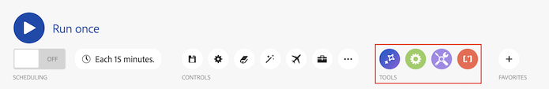

# Editor scenario

L’editor degli scenari consente di creare e modificare scenari in un’interfaccia visiva.

## Requisiti di accesso

+++ Espandi per visualizzare i requisiti di accesso per la funzionalità in questo articolo.

Per utilizzare le funzionalità di questo articolo, è necessario disporre dei seguenti diritti di accesso:

<table style="table-layout:auto">
 <col> 
 <col> 
 <tbody> 
  <tr> 
   <td role="rowheader">[!DNL Adobe Workfront] pacchetto</td> 
   <td> 
Qualsiasi
 </td> 
  </tr> 
  <tr data-mc-conditions=""> 
   <td role="rowheader">[!DNL Adobe Workfront] licenza</td> 
   <td> 
Nuovo: [!UICONTROL Standard]

Oppure

Corrente: [!UICONTROL Work] o versione successiva
 </td> 
  </tr> 
  <tr> 
   <td role="rowheader">[!DNL Adobe Workfront Fusion] licenza**</td> 
   <td>
   
Corrente: nessun requisito di licenza [!DNL Workfront Fusion].

   
Oppure

   
Legacy: qualsiasi 

   </td> 
  </tr> 
  <tr> 
   <td role="rowheader">Prodotto</td> 
   <td>
   
Nuovo:
 <ul><li>[!UICONTROL Select] o [!UICONTROL Prime] [!DNL Workfront] piano: l'organizzazione deve acquistare [!DNL Adobe Workfront Fusion].</li><li>[!UICONTROL Ultimate] [!DNL Workfront] piano: [!DNL Workfront Fusion] incluso.</li></ul>
   
Oppure

   
Corrente: la tua organizzazione deve acquistare [!DNL Adobe Workfront Fusion].

   </td> 
  </tr>
  <tr data-mc-conditions=""> 
   <td role="rowheader">Configurazioni del livello di accesso*</td> 
   <td> 
     
Devi essere un amministratore [!DNL Workfront Fusion] per la tua organizzazione.

     
Devi essere un amministratore [!DNL Workfront Fusion] per il tuo team.

   </td> 
  </tr> 
   </td> 
  </tr> 
 </tbody> 
</table>

Per ulteriori dettagli sulle informazioni contenute in questa tabella, vedere [Requisiti di accesso nella documentazione](/help/workfront-fusion/references/licenses-and-roles/access-level-requirements-in-documentation.md).

Per informazioni sulle [!DNL Adobe Workfront Fusion] licenze, vedere [[!DNL Adobe Workfront Fusion] licenze](/help/workfront-fusion/set-up-and-manage-workfront-fusion/licensing-operations-overview/license-automation-vs-integration.md).

+++

## Apri l’editor scenario e aggiungi un modulo:

1. Fai clic su **[!UICONTROL Scenarios]**  nel pannello a sinistra.
1. Fai clic sull&#39;icona del punto interrogativo , quindi individua e fai clic sull&#39;app o sul servizio con cui vuoi iniziare. Per informazioni dettagliate sulla configurazione di un modulo, vedere [Configurare un modulo](/help/workfront-fusion/create-scenarios/add-modules/configure-a-modules-settings.md).

## Azioni editor di scenari disponibili

### Esegui lo scenario

| Azione | Dettagli |
|----------|----------|
| Eseguire il test dello scenario | Verifica che lo scenario venga eseguito come previsto prima di attivarlo. Una volta attivato, lo scenario viene eseguito in base alla sua pianificazione. Se tutto non funziona come previsto, vedi [Gestione degli errori di aggiunta](/help/workfront-fusion/create-scenarios/config-error-handling/error-handling.md) per scoprire come gestire gli errori. |

### Pianificazione

| Azione | Dettagli |
|----------|----------|
| Pianificare lo scenario | Per impostazione predefinita, uno scenario viene eseguito ogni 15 minuti. Puoi modificare questa impostazione definendo quando e con quale frequenza viene eseguito uno scenario attivato. È possibile pianificare l&#39;esecuzione di scenari di fusione ogni 5 minuti. Per ulteriori informazioni, vedere [Pianificare uno scenario](/help/workfront-fusion/create-scenarios/config-scenarios-settings/schedule-a-scenario.md). |

### Controlli

| Azione | Dettagli |
|----------|----------|
| Salva | Dopo aver salvato lo scenario, sarà disponibile una nuova versione nel menu con tre punti, qualora tu debba accedervi in futuro. Le versioni degli scenari salvate in precedenza sono disponibili solo per 60 giorni. |
| Impostazioni scenario | Il pannello delle impostazioni dello scenario contiene le impostazioni avanzate per lo scenario. Per ulteriori informazioni sulle impostazioni disponibili, vedere [Configurare le impostazioni dello scenario](/help/workfront-fusion/create-scenarios/config-scenarios-settings/configure-scenario-settings.md). |
| Note | Prendi nota dello scenario. Altri utenti possono visualizzare queste note quando si trovano nello scenario. |
| Allineamento automatico | Allinea automaticamente i moduli nello scenario. |
| Spiega flusso | Visualizza un’animazione che mostra il flusso dei dati nello scenario. |
| Strumenti di sviluppo | Utilizzando Devtool, puoi controllare tutte le esecuzioni manuali dello scenario, esaminare tutte le operazioni eseguite e visualizzare i dettagli di ogni chiamata API eseguita. Puoi vedere quale modulo, operazione o singola risposta ha causato l’errore e sfruttare queste informazioni per perfezionare lo scenario. Per ulteriori informazioni, vedere [Eseguire il debug di uno scenario](/help/workfront-fusion/manage-scenarios/debug-a-scenario.md). |
| Altro | Nel menu Altro, puoi importare o esportare i blueprint e ripristinare lo scenario alle versioni precedenti. |

### Strumenti

| Azione | Dettagli |
|----------|----------|
| Controllo del flusso | Configura le impostazioni per controllare il modo in cui i dati scorrono all’interno di esso. Per ulteriori informazioni, [consulta collegamento necessario]. |
| Strumenti | La sezione Strumenti contiene diversi moduli utili che possono migliorare gli scenari. Per ulteriori informazioni, [consulta collegamento necessario]. |
| Parser testo | Utilizzare lo strumento parser di testo per analizzare il testo da utilizzare in altri moduli scenario. Il parser di testo non richiede una connessione. Per ulteriori informazioni, [consulta collegamento necessario]. |

### Preferiti

È possibile utilizzare l&#39;icona Preferiti per aggiungere i moduli utilizzati spesso.

