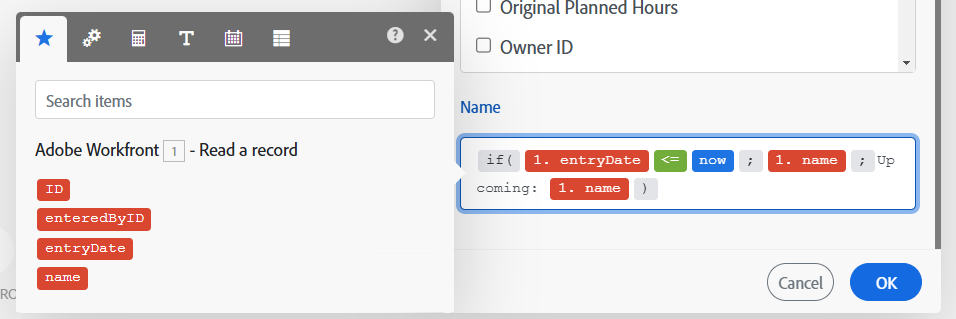
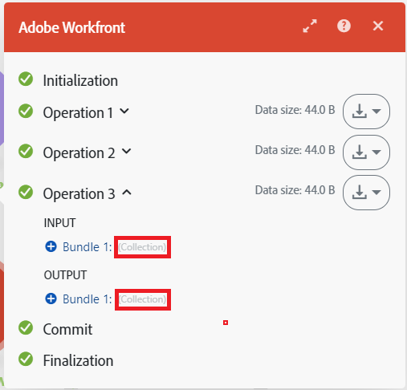

# Panoramica sulla mappatura

La mappatura è il processo di assegnazione degli output di un modulo ai campi di input di un altro modulo.

Il funzionamento di un modulo produce zero, uno o più bundle come output. Un bundle è costituito da uno o più elementi.

Puoi mappare questi elementi ai campi nei moduli successivi.

Quando fai clic su un campo in cui puoi inserire un valore generato da un modulo precedente in uno scenario, viene visualizzato il pannello di mappatura. Qui puoi selezionare l’elemento da mappare. Una mappatura può includere uno o più dei seguenti elementi:

* Un singolo elemento
* Più elementi
* Testo statico
* Funzioni

>[!BEGINSHADEBOX]

**Esempi**:

Elemento singolo

Più elementi con testo

Funzione con più elementi e testo

>[!ENDSHADEBOX]

Per istruzioni sulla mappatura, vedere gli articoli in [Dati mappa: indice articolo](/help/workfront-fusion/create-scenarios/map-data/map-data-toc.md).

>[!NOTE]
>
>Gli output dei moduli racchiusi tra un [!UICONTROL Iterator] e un [!UICONTROL Aggregator] non sono accessibili oltre il modulo [!UICONTROL Aggregator].

## Pannello di mappatura

Quando fai clic su un campo in cui puoi mappare i dati, viene aperto il pannello di mappatura.

Nella prima scheda  sono visualizzati gli elementi che è possibile mappare da altri moduli.

Le altre schede includono funzioni, operatori e parole chiave che è possibile utilizzare per creare formule. Questi vengono ordinati in schede diverse in base al tipo di dati che gestiscono.

Per ulteriori informazioni sulle schede delle funzioni, vedere [Panoramica delle funzioni](/help/workfront-fusion/get-started-with-fusion/understand-fusion/function-overview.md).

Per ulteriori informazioni sulla mappatura degli elementi tramite le funzioni, vedere [Mappare gli elementi utilizzando le funzioni](/help/workfront-fusion/create-scenarios/map-data/map-using-functions.md).

## Raccolte

Gli elementi possono contenere più valori di vari tipi. Si tratta di elementi di tipo raccolta.

I bundle di tipo raccolta vengono visualizzati `(Collection)` accanto all&#39;etichetta del bundle nell&#39;output del modulo.

Nella maggior parte dei casi, è possibile mappare gli elementi della raccolta anziché l&#39;elemento che rappresenta l&#39;intera raccolta.

Per individuare l&#39;elemento di una raccolta nel pannello di mappatura, fate clic sulla freccia accanto alla raccolta.

Per ulteriori informazioni sulle raccolte, vedere [Tipi di dati elemento](/help/workfront-fusion/references/mapping-panel/data-types/item-data-types.md).

Per istruzioni sulla mappatura delle raccolte, vedere [Mappare un elemento](/help/workfront-fusion/create-scenarios/map-data/map-data-from-one-to-another.md#map-an-item) nell&#39;articolo Mappare le informazioni da un modulo all&#39;altro.

## Array

Gli elementi possono contenere più valori dello stesso tipo. Si tratta di elementi di tipo array.

I bundle di tipo array vengono visualizzati `(Array)` accanto all&#39;etichetta del bundle nell&#39;output del modulo.

Nel pannello di mappatura, gli array vengono visualizzati con parentesi quadre. È possibile identificare un elemento di tipo matrice tramite le parentesi quadre alla fine dell&#39;etichetta dell&#39;elemento. Per individuare un elemento di array specifico nel pannello di mappatura, fate clic sulla freccia accanto all&#39;array.

Per informazioni e istruzioni sulla mappatura di array ed elementi di array, vedere [Mappare array ed elementi di array](/help/workfront-fusion/create-scenarios/map-data/map-an-array.md).
