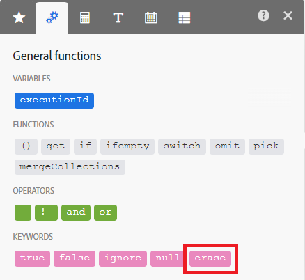

# Panoramica del modulo

Adobe Workfront Fusion distingue cinque tipi di moduli:

* Moduli di azione
* Moduli ricerca
* Moduli trigger
* Aggregatori
* Iteratori

Aggregatori e Iteratori sono per scenari avanzati.

## Moduli di azione

I moduli di azione sono il tipo di modulo più comune. Un modulo di azione tipico esegue un’azione e restituisce un singolo bundle, che quindi passa al modulo successivo per l’elaborazione.

A differenza dei moduli di attivazione, i moduli di azione possono essere posizionati all’inizio, al centro o alla fine di uno scenario.

Gli scenari possono contenere un numero illimitato di moduli di azione, anche se un numero elevato di moduli (oltre 150) può influire sulle prestazioni.

>[!BEGINSHADEBOX]

**Esempi:**

* **[!DNL Workfront]>[!UICONTROL Upload a file]** invia un file a [!DNL Workfront] e restituisce il relativo identificatore.
* **[!UICONTROL Image]>[!UICONTROL Resize]** riceve un&#39;immagine, la ridimensiona alle dimensioni specificate e la trasmette all&#39;azione successiva.

>[!ENDSHADEBOX]

Il tipo di azione è costituito da quattro sottotipi:

* Crea
* Letto
* Aggiorna
* Elimina

Il sottotipo Update include le tre operazioni seguenti:

* **Cancellare il contenuto di un campo**. Questa operazione viene eseguita quando il contenuto del campo viene valutato in base alla parola chiave `erase` (da non confondere con `empty`).

  

* **Lasciare invariato il contenuto di un campo**. Questa operazione viene eseguita quando il campo viene lasciato vuoto o il contenuto del campo viene valutato come vuoto (rappresentato da null in JSON).

  

* **Sostituisci il contenuto di un campo**. Questa operazione viene eseguita in tutti gli altri casi diversi da quelli sopra descritti.

>[!NOTE]
>
>* Se non vedi la parola chiave `erase` nel pannello di mappatura, il modulo non è un modulo di aggiornamento o non è stato aggiornato alle specifiche più recenti per l&#39;app.
>* `Empty` non modifica il contenuto del campo. Se è necessario cancellare il campo, puoi utilizzare la seguente formula:
>
>   
>
>* Non è al momento possibile lasciare un campo invariato quando il relativo contenuto viene valutato come vuoto.

## Moduli ricerca

I moduli di ricerca restituiscono zero, uno o più bundle, che quindi passano al modulo successivo per l’elaborazione.

È possibile posizionare i moduli di ricerca all&#39;inizio, al centro o alla fine di uno scenario.

Gli scenari possono contenere un numero illimitato di moduli di ricerca, anche se un numero elevato di moduli (oltre 150) può influire sulle prestazioni.

>[!BEGINSHADEBOX]

**Esempio:**

**[!DNL Workfront]>[!UICONTROL Read Related Records]** legge i record corrispondenti alla query di ricerca specificata, in un particolare oggetto padre.

>[!ENDSHADEBOX]

## Moduli trigger

I trigger generano bundle quando si è verificata una modifica in un determinato servizio, ad esempio la creazione o l’aggiornamento di un record.

I trigger restituiscono zero, uno o più bundle, che quindi passano al modulo successivo per l’elaborazione.

Poiché i trigger determinano l’inizio dell’esecuzione degli scenari, è possibile posizionarli solo all’inizio di uno scenario.

Ogni scenario può contenere un solo trigger.

[!DNL Workfront Fusion] utilizza due tipi di trigger: Polling triggers e Instant triggers.

### Trigger di polling

I trigger di polling eseguono regolarmente il polling di un determinato servizio anche se non sono state apportate modifiche dall’esecuzione dello scenario precedente. È consigliabile pianificare uno scenario contenente un trigger di polling da eseguire a intervalli regolari. Se una modifica corrisponde alla configurazione del trigger, quest’ultimo restituisce bundle contenenti informazioni sulla modifica. Se non vi è alcuna modifica che corrisponda alla configurazione, il trigger non restituisce alcun bundle.

Per istruzioni sulla pianificazione di uno scenario, vedere [Pianificare uno scenario](/help/workfront-fusion/create-scenarios/config-scenarios-settings/schedule-a-scenario.md).

I trigger di polling consentono di selezionare il primo bundle che deve essere emesso tramite un pannello che viene visualizzato automaticamente dopo il salvataggio di un trigger o la modifica delle relative impostazioni. Questa selezione influisce solo sulla prima esecuzione del modulo. Dopo che il modulo è stato eseguito una volta, le esecuzioni successive verificano solo le modifiche che si verificano dopo l’esecuzione più recente.

Per ulteriori informazioni, vedere [Scegliere la posizione di inizio di un modulo trigger](/help/workfront-fusion/create-scenarios/add-modules/choose-where-trigger-module-starts.md).

>[!BEGINSHADEBOX]

**Esempi:**

* **[!DNL Workfront]>[!UICONTROL Watch records]** restituisce i record appena aggiunti dopo l&#39;ultima esecuzione dello scenario.

* **[!DNL Google Sheets]>[!UICONTROL Watch Rows]** restituisce nuove righe aggiunte dopo l&#39;ultima esecuzione dello scenario.

>[!ENDSHADEBOX]

### Trigger istantanei

I trigger istantanei consentono a un servizio di notificare a [!DNL Workfront Fusion] una modifica subito dopo che si è verificata. È consigliabile pianificare uno scenario contenente un trigger istantaneo da eseguire immediatamente.

Per istruzioni, consulta [Pianificare uno scenario](/help/workfront-fusion/create-scenarios/config-scenarios-settings/schedule-a-scenario.md).

Per informazioni dettagliate sulla gestione dei dati in arrivo tramite un trigger immediato, vedere [Trigger istantanei (webhook)](/help/workfront-fusion/references/modules/webhooks-reference.md).

>[!BEGINSHADEBOX]

**Esempi:**

* **[!DNL Workfront]>[!UICONTROL Watch Events]** restituisce informazioni quando si verifica un determinato tipo di evento in Workfront, ad esempio la creazione di un&#39;attività.
* **[!DNL Google Sheets]>[!UICONTROL Watch Changes]** restituisce informazioni ogni volta che una cella viene aggiornata.

>[!ENDSHADEBOX]

## Aggregatori

Un modulo Aggregator accumula più bundle in un singolo bundle.

Gli aggregatori restituiscono un solo bundle, che quindi passa al modulo successivo per l’ulteriore elaborazione.

È possibile posizionare gli aggregatori solo nel mezzo di uno scenario.

Gli scenari possono contenere un numero illimitato di aggregatori, anche se un numero elevato di moduli (oltre 150) può influire sulle prestazioni.

>[!BEGINSHADEBOX]

**Esempi:**

* **[!UICONTROL Archive]>[!UICONTROL Create an archive]** comprime più file in un archivio zip.
* **[!UICONTROL CSV]>[!UICONTROL Aggregate to CSV]** unisce più stringhe da un file CSV in un&#39;unica riga.
* **[!UICONTROL Tools]>[!UICONTROL Text aggregator]** combina più stringhe in un&#39;unica stringa.

>[!ENDSHADEBOX]

Per ulteriori informazioni, vedere [Modulo aggregatore](/help/workfront-fusion/references/modules/aggregator-module.md).

## Iteratori

Un iteratore è un tipo di modulo che divide gli array in bundle separati.

Gli iteratori restituiscono uno o più bundle, che quindi passano al modulo successivo per l’elaborazione.

È possibile posizionare gli iteratori solo nel mezzo di uno scenario.

Gli scenari possono contenere un numero illimitato di iteratori, anche se un numero elevato di moduli (oltre 150) può influire sulle prestazioni.

>[!BEGINSHADEBOX]

**Esempio:**

**[!UICONTROL Email]>[!UICONTROL Retrieve attachments]** suddivide un array di allegati in bundle separati.

>[!ENDSHADEBOX]

Per ulteriori informazioni, vedere [Modulo iteratore](/help/workfront-fusion/references/modules/iterator-module.md) e [Mappare un array](/help/workfront-fusion/create-scenarios/map-data/map-an-array.md).
