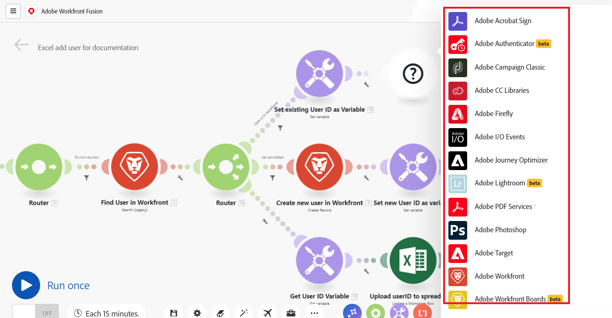

# Panoramica degli scenari

Il ruolo di Adobe Workfront Fusion è quello di automatizzare i processi in modo che gli utenti non debbano dedicare troppo tempo alle attività di routine. Funziona collegando azioni all’interno e tra le app e o servizi per creare uno scenario che trasferisce e trasforma automaticamente i dati. Lo scenario creato controlla i dati in un’app o in un servizio e li elabora in modo da fornire il risultato desiderato.

Uno scenario è costituito da una serie di moduli che indicano come i dati devono essere trasformati all’interno di un’app o trasferiti tra le app e i servizi web.

## Panoramica sugli elementi dello scenario

Uno scenario è composto da elementi diversi. Comprendere la terminologia di tali elementi semplifica l’utilizzo della documentazione.

* [Scenario](#scenario)
* [Trigger](#trigger)
* [Modulo](#module)
* [Percorso](#route)
* [Segmento dello scenario](#scenario-segment)
* [Connettore](#connector)

### Scenario

Uno **scenario** è una serie di passaggi automatizzati creati dall’utente per spostare e manipolare i dati. Il termine “scenario” fa riferimento all’intero gruppo di passaggi collegati.

### Trigger

Uno scenario inizia con un **trigger**. Il trigger controlla i dati nuovi e aggiornati e inizia lo scenario quando vengono applicate determinate condizioni configurate nel modulo. I trigger possono essere configurati per iniziare uno scenario secondo una pianificazione (polling) oppure ogni volta che si verificano modifiche ai dati (istantaneo).

### Modulo

Il trigger è seguito da una serie di **moduli**. Un modulo rappresenta un singolo passaggio in uno scenario che esegue un’azione specifica. I moduli sono configurati e concatenati tra loro per creare scenari.

### Percorso

Uno scenario può essere diviso in **percorsi**. Un percorso è una sezione dello scenario che può essere o meno utilizzato per un determinato bundle di dati. I percorsi vengono configurati utilizzando un modulo router e filtri.

### Segmento dello scenario

Un segmento dello scenario è una sezione di uno scenario costituita da una serie di moduli contigui che si connettono tutti alla stessa applicazione. I segmenti dello scenario spesso rappresentano un breve flusso di lavoro nell’applicazione.

### Connettore

Un connettore è il set di moduli per una determinata applicazione. Workfront Fusion offre connettori per molte applicazioni di lavoro comuni, come Workfront, Salesforce e Jira, nonché connettori generici che possono essere utilizzati per qualsiasi servizio web.

## Esempi

Espandi le sezioni seguenti per visualizzare scenari di esempio e le relative spiegazioni.

+++**Automazione dei processi in Adobe Workfront**

Workfront Fusion consente di automatizzare flussi di lavoro semplici o complessi all’interno di Workfront, risparmiando tempo e garantendo un’esecuzione coerente del processo.

In questo esempio, lo scenario viene attivato quando un campo specificato cambia in un’attività o in un problema in Workfront. Quando viene attivato, lo scenario ottiene informazioni nel progetto correlato e crea un aggiornamento personalizzato per una persona assegnata a un ruolo specifico nel progetto.

+++

+++**Collegare Workfront a un’altra app o servizio web**

>[!NOTE]
>
>Se la tua organizzazione utilizza il modello di licenza legacy, per eseguire il collegamento ad altre applicazioni è necessario che disponga di una licenza Workfront Fusion for Work Automation and Integration.

Workfront Fusion è in grado di collegarsi ad altre applicazioni e servizi web. È possibile accedere, importare, manipolare o esportare dati da altre applicazioni, integrandoli con Workfront o tra loro.

Molte applicazioni dispongono di connettori Workfront Fusion dedicati. Se non è disponibile un connettore dedicato per l’applicazione a cui desideri accedere, è possibile utilizzare i moduli HTTP o SOAP di Workfront Fusion per connettersi all’applicazione tramite la relativa API.

In questo esempio, lo scenario viene attivato quando un utente viene aggiunto a un foglio di calcolo [!DNL Excel]. Lo scenario verifica se l’utente si trova in Workfront. In caso contrario, lo scenario crea l’utente in Workfront e aggiunge nuovamente l’ID utente al foglio di calcolo.

Per un elenco dei connettori dedicati, consulta [Riferimenti alle applicazioni Fusion e ai relativi moduli: indice degli articoli](/help/workfront-fusion/references/apps-and-modules/apps-and-modules-toc.md).

>[!IMPORTANT]
>
>Adobe Workfront Fusion è in grado di collegarsi a quasi tutti i servizi web. Se l’app che desideri utilizzare non dispone di un connettore Workfront Fusion dedicato, puoi utilizzare connettori universali per connetterti all’app o al servizio.
>
>Per un elenco dei connettori universali, consulta [Connettori universali](/help/workfront-fusion/references/apps-and-modules/apps-and-modules-toc.md#universal-connectors)

+++

## Riferimenti

* Per un glossario dei termini utilizzati in Workfront Fusion, consulta [Glossario di Adobe Workfront Fusion](/help/workfront-fusion/get-started-with-fusion/understand-fusion/fusion-glossary.md).
* Per iniziare a creare uno scenario di esercitazione, consulta [Creare uno scenario di base](/help/workfront-fusion/build-practice-scenarios/create-basic-scenario.md).
* Per informazioni sulla creazione e la gestione degli scenari, consulta gli articoli elencati in:
   * [Creare scenari](/help/workfront-fusion/create-scenarios/create-scenarios-toc.md)
   * [Gestire gli scenari](/help/workfront-fusion/manage-scenarios/manage-scenarios-toc.md)
