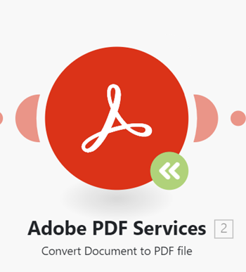

# Aggiornare un modulo a una nuova versione

Poiché le applicazioni a cui Workfront Fusion si connette possono aggiornare o rilasciare nuove versioni, è talvolta necessario che Fusion rilasci moduli aggiornati per tali applicazioni.

Se in uno scenario viene visualizzata l&#39;icona verde del modulo Aggiornamento, Workfront Fusion ha rilasciato una nuova versione di tale modulo.

Puoi aggiornare il modulo senza creare un nuovo scenario.

## Requisiti di accesso

+++ Espandi per visualizzare i requisiti di accesso per la funzionalità descritta in questo articolo.

<table style="table-layout:auto">
 <col> 
 <col> 
 <tbody> 
  <tr> 
   <td role="rowheader">Pacchetto Adobe Workfront</td> 
   <td> 
Qualsiasi pacchetto Workflow di Adobe Workfront, e qualsiasi pacchetto Automation and Integration di Adobe Workfront.

Workfront Ultimate

Pacchetti Workfront Prime e Select, con un ulteriore acquisto di Workfront Fusion.
 </td> 
  </tr> 
  <tr data-mc-conditions=""> 
   <td role="rowheader">Licenze Adobe Workfront</td> 
   <td> 
Standard

Work o successiva
 </td> 
  </tr> 
  <tr> 
   <td role="rowheader">Prodotto</td> 
   <td>
   
Se la tua organizzazione dispone di un pacchetto Workfront Select o Prime che non include Workfront Automation and Integration, dovrà acquistare Adobe Workfront Fusion.</li></ul>
   </td> 
  </tr>
 </tbody> 
</table>

Per ulteriori dettagli sulle informazioni contenute in questa tabella, consulta [Requisiti di accesso nella documentazione](/help/workfront-fusion/references/licenses-and-roles/access-level-requirements-in-documentation.md).

+++

## Aggiornare un modulo Workfront a una nuova versione

1. Fai clic sull&#39;icona **Aggiorna modulo**  nel modulo che desideri aggiornare a una nuova versione.
   
1. Scegliere una delle opzioni seguenti:

   * Per selezionare un nuovo modulo da sostituire (anziché aggiornare il modulo), fare clic su **Scegli nuovo**, quindi procedere come descritto in [Aggiornare un modulo non Workfront a una nuova versione](#upgrade-a-non-workfront-module-to-a-new-version).
   * Per aggiornare solo questo modulo, mantenendo la configurazione del modulo, fai clic su **Aggiorna**.
   * Per aggiornare tutti i moduli Workfront nello scenario, fare clic su **Aggiorna tutti**.

1. Salva lo scenario.

>[!NOTE]
>
>Se hai aggiornato i moduli Workfront, ti consigliamo di aprirli e di controllare la configurazione del modulo.

## Aggiornare un modulo non Workfront a una nuova versione

1. Fai clic sull&#39;icona **Aggiorna modulo**  nel modulo che desideri aggiornare a una nuova versione.
   
1. Fare clic su **Scegli nuovo**.
1. Selezionare il modulo che si desidera sostituire al modulo precedente.
1. Configura il modulo con le stesse impostazioni del modulo esistente.
1. Connetti il nuovo modulo allo scenario nello stesso punto del modulo esistente.
1. Elimina il modulo precedente.
1. Salva lo scenario.
