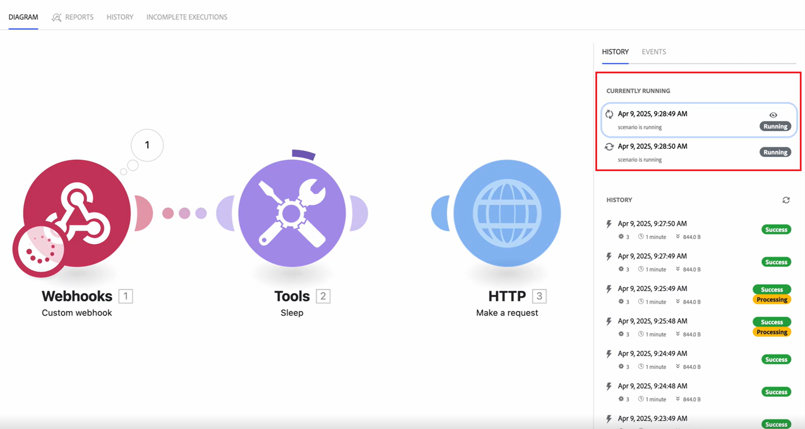

# Visualizzare il flusso di dati in uno scenario in esecuzione

Puoi guardare uno scenario in esecuzione per vedere come scorrono i dati.

Durante l’esecuzione di uno scenario, il modulo attivo è contrassegnato da un anello in crescita intorno al modulo. L’anello mostra solo che il modulo è in esecuzione, non il suo avanzamento. I moduli che vengono eseguiti rapidamente possono visualizzare solo una piccola parte dell&#39;anello.

Dopo l&#39;esecuzione del modulo, viene visualizzato un indicatore di output.

Se il modulo elabora più di un bumdle, l&#39;anello appare per ogni bundle elaborato e l&#39;indicatore di output conta per ogni bundle che produce.

Per ulteriori informazioni sul flusso di dati dello scenario, vedere [Flusso di esecuzione dello scenario](/help/workfront-fusion/references/scenarios/scenario-execution-flow.md).

## Requisiti di accesso

+++ Espandi per visualizzare i requisiti di accesso per la funzionalità in questo articolo.

Per utilizzare le funzionalità di questo articolo, è necessario disporre dei seguenti diritti di accesso:

<table style="table-layout:auto">
 <col> 
 <col> 
 <tbody> 
  <tr> 
   <td role="rowheader">[!DNL Adobe Workfront] pacchetto</td> 
   <td> 
Qualsiasi
 </td> 
  </tr> 
  <tr data-mc-conditions=""> 
   <td role="rowheader">[!DNL Adobe Workfront] licenza</td> 
   <td> 
Nuovo: [!UICONTROL Standard]

Oppure

Corrente: [!UICONTROL Work] o versione successiva
 </td> 
  </tr> 
  <tr> 
   <td role="rowheader">[!DNL Adobe Workfront Fusion] licenza**</td> 
   <td>
   
Corrente: nessun requisito di licenza [!DNL Workfront Fusion].

   
Oppure

   
Legacy: qualsiasi 

   </td> 
  </tr> 
  <tr> 
   <td role="rowheader">Prodotto</td> 
   <td>
   
Nuovo:
 <ul><li>Piano [!UICONTROL Select] o [!UICONTROL Prime] [!DNL Workfront]: l'organizzazione deve acquistare [!DNL Adobe Workfront Fusion].</li><li>Il piano [!UICONTROL Ultimate] [!DNL Workfront]: [!DNL Workfront Fusion] è incluso.</li></ul>
   
Oppure

   
Corrente: la tua organizzazione deve acquistare [!DNL Adobe Workfront Fusion].

   </td> 
  </tr>
  <tr data-mc-conditions=""> 
   <td role="rowheader">Configurazioni del livello di accesso*</td> 
   <td> 
     
Devi essere un amministratore [!DNL Workfront Fusion] per la tua organizzazione.

     
Devi essere un amministratore [!DNL Workfront Fusion] per il tuo team.

   </td> 
  </tr> 
   </td> 
  </tr> 
 </tbody> 
</table>

Per ulteriori dettagli sulle informazioni contenute in questa tabella, vedere [Requisiti di accesso nella documentazione](/help/workfront-fusion/references/licenses-and-roles/access-level-requirements-in-documentation.md).

Per informazioni sulle [!DNL Adobe Workfront Fusion] licenze, vedere [[!DNL Adobe Workfront Fusion] licenze](/help/workfront-fusion/set-up-and-manage-workfront-fusion/licensing-operations-overview/license-automation-vs-integration.md).

+++

## Visualizzare il flusso di dati in uno scenario in esecuzione

1. Fai clic sulla scheda **[!UICONTROL Scenari]** nel pannello a sinistra.
1. Seleziona lo scenario in cui desideri visualizzare il flusso di dati.
1. Se lo scenario non è in esecuzione, attivarlo o fare clic su **Esegui una volta** per avviare l&#39;esecuzione dello scenario.
1. Seleziona l’esecuzione da visualizzare nella sezione Attualmente in esecuzione del pannello Cronologia esecuzione.

