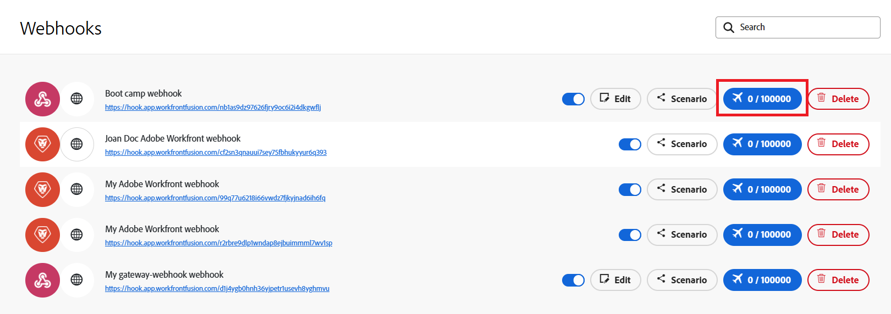

# Visualizzare la coda di un webhook

Molti servizi forniscono webhook per inviare notifiche istantanee ogni volta che si verifica una certa modifica nel servizio. I trigger istantanei, noti anche come webhook, possono utilizzare questi eventi per iniziare gli scenari. Gli eventi entrano nella coda del webhook mentre sono in attesa di elaborazione, ad esempio quando lo scenario è già in esecuzione. Puoi visualizzare la coda del webhook.

I dati del webhook in arrivo vengono sempre memorizzati nella coda indipendentemente da come hai impostato l’opzione Dati riservati nel pannello delle impostazioni dello scenario. Dopo che i dati vengono elaborati in uno scenario, vengono eliminati definitivamente dalla coda.

Per ulteriori informazioni sui webhook, vedere [Trigger istantanei (webhook)](/help/workfront-fusion/references/modules/webhooks-reference.md).

## Requisiti di accesso

+++ Espandi per visualizzare i requisiti di accesso per la funzionalità in questo articolo.

<table style="table-layout:auto">
 <col> 
 <col> 
 <tbody> 
  <tr> 
   <td role="rowheader">Pacchetto Adobe Workfront</td> 
   <td> 
Qualsiasi pacchetto di flusso di lavoro Adobe Workfront e qualsiasi pacchetto di automazione e integrazione Adobe Workfront

Workfront Ultimate

Pacchetti Workfront Prime e Select, con un ulteriore acquisto di Workfront Fusion.
 </td> 
  </tr> 
  <tr data-mc-conditions=""> 
   <td role="rowheader">Licenze Adobe Workfront</td> 
   <td> 
Standard

Lavoro o superiore
 </td> 
  </tr> 
  <tr> 
   <td role="rowheader">Prodotto</td> 
   <td>
   
Se la tua organizzazione dispone di un pacchetto Select o Prime Workfront che non include l’automazione e l’integrazione di Workfront, deve acquistare Adobe Workfront Fusion.</li></ul>
   </td> 
  </tr>
 </tbody> 
</table>

Per ulteriori dettagli sulle informazioni contenute in questa tabella, vedere [Requisiti di accesso nella documentazione](/help/workfront-fusion/references/licenses-and-roles/access-level-requirements-in-documentation.md).

+++

## Visualizzare la coda di un webhook

Tutti i messaggi provenienti dai webhook in ingresso vengono memorizzati nella coda del webhook.

Se uno scenario al momento presenta una coda, in tale scenario viene visualizzato un banner:

Per visualizzare la coda di un webhook:

1. Fai clic su **[!UICONTROL Webhook]** nel menu a sinistra.
1. Individuare il webhook per il quale si desidera visualizzare la coda.
1. Individua il numero di eventi nel pulsante Eventi ricevuti.

   

1. Fai clic sul pulsante per visualizzare i dettagli sugli eventi in coda.
