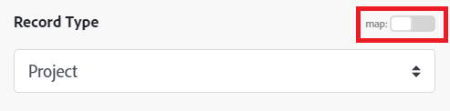

# Moduli [!DNL Azure Active Directory]

In uno scenario Adobe Workfront Fusion, puoi automatizzare i flussi di lavoro che utilizzano [!DNL Azure Active Directory], nonché collegarli a più applicazioni e servizi di terze parti.

Per istruzioni sulla creazione di uno scenario, consulta gli articoli in [Creare scenari: indice degli articoli](/help/workfront-fusion/create-scenarios/create-scenarios-toc.md).

Per informazioni sui moduli, consulta gli articoli in [Moduli: indice degli articoli](/help/workfront-fusion/references/modules/modules-toc.md).

## Requisiti di accesso

+++ Espandi per visualizzare i requisiti di accesso per la funzionalità descritta in questo articolo.

<table style="table-layout:auto">
 <col> 
 <col> 
 <tbody> 
  <tr> 
   <td role="rowheader">Pacchetto Adobe Workfront</td> 
   <td> 
Qualsiasi pacchetto Workflow di Adobe Workfront, e qualsiasi pacchetto Automation and Integration di Adobe Workfront.

Workfront Ultimate

Pacchetti Workfront Prime e Select, con un ulteriore acquisto di Workfront Fusion.
 </td> 
  </tr> 
  <tr data-mc-conditions=""> 
   <td role="rowheader">Licenze Adobe Workfront</td> 
   <td> 
Standard

Work o successiva
 </td> 
  </tr> 
  <tr> 
   <td role="rowheader">Licenza di Adobe Workfront Fusion</td> 
   <td>
   
Basata sulle operazioni: nessun requisito di licenza Workfront Fusion

   
Basata su connettore (precedente): Workfront Fusion for Work Automation and Integration 

   </td> 
  </tr> 
  <tr> 
   <td role="rowheader">Prodotto</td> 
   <td>
   
Se la tua organizzazione dispone di un pacchetto Workfront Select o Prime che non include Workfront Automation and Integration, dovrà acquistare Adobe Workfront Fusion.</li></ul>
   </td> 
  </tr>
 </tbody> 
</table>

Per ulteriori dettagli sulle informazioni contenute in questa tabella, consulta [Requisiti di accesso nella documentazione](/help/workfront-fusion/references/licenses-and-roles/access-level-requirements-in-documentation.md).

Per informazioni sulle licenze di Adobe Workfront Fusion, consulta [Licenze di Adobe Workfront Fusion](/help/workfront-fusion/set-up-and-manage-workfront-fusion/licensing-operations-overview/license-automation-vs-integration.md).

+++

## Prerequisiti

Per utilizzare i moduli [!DNL Azure Active Directory], è necessario disporre di un account [!DNL Azure Active Directory].

## Informazioni API di [!DNL Azure Active Directory]

Il connettore Azure Active Directory utilizza quanto segue:

<table style="table-layout:auto"> 
 <col> 
 <col> 
 <tbody> 
  <tr> 
   <td role="rowheader">Versione API</td> 
   <td> v1.0 </td> 
  </tr> 
  <tr> 
   <td role="rowheader">Tag API</td> 
   <td>v1.4.5</td> 
  </tr>
 </tbody> 
</table>

## Moduli [!DNL Azure Active Directory] e relativi campi

Quando configuri i moduli [!DNL Azure Active Directory], in Workfront Fusion vengono visualizzati i campi elencati di seguito. Insieme a questi, potrebbero essere visualizzati altri campi di [!DNL Azure Active Directory], a seconda di fattori quali il tuo livello di accesso nell’app o nel servizio. Un titolo in grassetto in un modulo indica un campo obbligatorio.

Se visualizzi il pulsante Map (Mappa) sopra un campo o una funzione, puoi utilizzarlo per impostare variabili e funzioni per tale campo. Per ulteriori informazioni, vedere [Mappare le informazioni da un modulo all&#39;altro in Adobe Workfront Fusion](/help/workfront-fusion/create-scenarios/map-data/map-data-from-one-to-another.md).

* [Trigger](#triggers)
* [Azioni](#actions)
* [Ricerche](#searches)

### Trigger

#### [!UICONTROL Controlla i record] (pianificato)

Questo modulo di attivazione del polling (pianificato) esegue uno scenario in cui un record in un oggetto selezionato è stato creato dopo l&#39;ultima esecuzione pianificata in [!DNL Azure Active Directory]. Vengono inoltre restituiti tutti i campi standard associati al record o ai record, nonché tutti i campi e i valori personalizzati a cui la connessione accede.Puoi mappare queste informazioni nei moduli successivi dello scenario.

Durante la configurazione di questo modulo, vengono visualizzati i seguenti campi.

<table style="table-layout:auto"> 
 <col> 
 <col> 
 <tbody> 
  <tr> 
   <td role="rowheader">[!UICONTROL Connessione]</td> 
   <td> 
Per istruzioni sulla connessione dell'account [!DNL Azure Active Directory] a Workfront Fusion, vedere <a href="/help/workfront-fusion/create-scenarios/connect-to-apps/connect-to-fusion-general.md" class="MCXref xref" data-mc-variable-override="">Creare una connessione ad Adobe Workfront Fusion - Istruzioni di base</a>.
 </td> 
  </tr> 
  <tr> 
   <td role="rowheader">[!UICONTROL Tipo]</td> 
   <td>Specificare se si desidera controllare i record Utente o Gruppo.</td> 
  </tr> 
  <tr> 
   <td role="rowheader">[!UICONTROL Numero massimo di record]</td> 
   <td>Inserisci oppure mappa il numero massimo di record che il modulo potrà restituire durante ciascun ciclo di esecuzione dello scenario.</td> 
  </tr> 
 </tbody> 
</table>

### Azioni

* [[!UICONTROL Leggi record]](#read-record)
* [[!UICONTROL Crea record]](#create-record)
* [[!UICONTROL Chiamata API personalizzata]](#custom-api-call)

#### [!UICONTROL Leggi record]

Questo modulo di azione legge i dati da un singolo record in [!DNL Azure Active Directory].

Specifica l’ID del record.

Il modulo restituisce l’ID del record e gli eventuali campi associati, insieme a eventuali campi e valori personalizzati a cui ha accesso la connessione. Puoi mappare queste informazioni nei moduli successivi dello scenario.

Per recuperare queste informazioni, è necessario disporre di autorizzazioni sufficienti per accedere al record in [!DNL Azure Active Directory].

Durante la configurazione di questo modulo, vengono visualizzati i seguenti campi.

<table style="table-layout:auto">
 <col> 
 <col> 
 <tbody> 
  <tr> 
   <td role="rowheader">[!UICONTROL Connessione]</td> 
   <td> 
Per istruzioni sulla connessione dell'account [!DNL Azure Active Directory] a Workfront Fusion, vedere <a href="/help/workfront-fusion/create-scenarios/connect-to-apps/connect-to-fusion-general.md" class="MCXref xref" data-mc-variable-override="">Creare una connessione ad Adobe Workfront Fusion - Istruzioni di base</a>.
 </td> 
  </tr> 
  <tr> 
   <td role="rowheader">[!UICONTROL Tipo di record]</td> 
   <td>Specificare se si desidera leggere un record [!UICONTROL User] o un record [!UICONTROL Group].</td> 
  </tr> 
  <tr> 
   <td role="rowheader">[!UICONTROL Output]</td> 
   <td>Seleziona le informazioni che desideri includere nel bundle di output per questo modulo.</td> 
  </tr> 
  <tr> 
   <td role="rowheader">[!UICONTROL ID]</td> 
   <td>Immettere o mappare l'ID [!DNL Azure Active Directory] univoco del record che si desidera venga letto dal modulo.</td> 
  </tr> 
 </tbody> 
</table>

#### [!UICONTROL Crea record]

Questo modulo di azione crea un nuovo record utente o gruppo.

Specificare il tipo di record desiderato.

Il modulo restituisce l’ID del record e gli eventuali campi associati, insieme a eventuali campi e valori personalizzati a cui ha accesso la connessione. Puoi mappare queste informazioni nei moduli successivi dello scenario.

Durante la configurazione di questo modulo, vengono visualizzati i seguenti campi.

<table style="table-layout:auto">
 <col> 
 <col> 
 <tbody> 
  <tr> 
   <td role="rowheader">[!UICONTROL Connessione]</td> 
   <td> 
Per istruzioni sulla connessione dell'account [!DNL Azure Active Directory] a Workfront Fusion, vedere <a href="/help/workfront-fusion/create-scenarios/connect-to-apps/connect-to-fusion-general.md" class="MCXref xref" data-mc-variable-override="">Creare una connessione ad Adobe Workfront Fusion - Istruzioni di base</a>.
 </td> 
  </tr> 
  <tr> 
   <td role="rowheader">[!UICONTROL Tipo di record]</td> 
   <td>Specificare se si desidera leggere un record [!UICONTROL User] o un record [!UICONTROL Group].</td> 
  </tr> 
  <tr> 
   <td role="rowheader">[!UICONTROL Altri Campi]</td> 
   <td>Compila questi campi per impostare i valori per il nuovo record.</td> 
  </tr> 
 </tbody> 
</table>

#### [!UICONTROL Chiamata API personalizzata]

Questo modulo di azione consente di effettuare una chiamata autenticata personalizzata all’API [!DNL Azure Active Directory]. In questo modo puoi creare un’automazione del flusso di dati che non può essere eseguita dagli altri moduli [!DNL Azure Active Directory].

Durante la configurazione di questo modulo, vengono visualizzati i seguenti campi.

<table style="table-layout:auto">
 <col> 
 <col> 
 <tbody> 
  <tr> 
   <td role="rowheader">[!UICONTROL Connessione]</td> 
   <td> 
Per istruzioni sulla connessione dell'account [!DNL Azure Active Directory] a Workfront Fusion, vedere <a href="/help/workfront-fusion/create-scenarios/connect-to-apps/connect-to-fusion-general.md" class="MCXref xref" data-mc-variable-override="">Creare una connessione ad Adobe Workfront Fusion - Istruzioni di base</a>.
 </td> 
  </tr> 
  <tr> 
   <td role="rowheader">[!UICONTROL URL]</td> 
   <td>Inserisci o mappa un percorso relativo a <code>https://graph.microsoft.com/{version}/{resource}?{query-parameters}</code></td> 
  </tr> 
  <tr> 
   <td role="rowheader">[!UICONTROL Metodo]</td> 
   <td> 
Seleziona il metodo di richiesta HTTP necessario per configurare la chiamata API. Per ulteriori informazioni, consulta <a href="/help/workfront-fusion/references/modules/http-request-methods.md" class="MCXref xref" data-mc-variable-override="">Metodi di richiesta HTTP</a>.
 </td> 
  </tr> 
  <tr> 
   <td role="rowheader">[!UICONTROL Intestazioni]</td> 
   <td> 
Aggiungi le intestazioni della richiesta sotto forma di oggetto JSON standard.
 
Ad esempio: <code>{"Content-type":"application/json"}</code>
 </td> 
  </tr> 
  <tr> 
   <td role="rowheader">[!UICONTROL Stringa di query]</td> 
   <td> 
Aggiungi la query per la chiamata API come oggetto JSON standard.
 
Ad esempio: <code>{"name":"something-urgent"}</code>
 </td> 
  </tr> 
  <tr> 
   <td role="rowheader">[!UICONTROL Corpo]</td> 
   <td> 
Aggiungi il contenuto del corpo della chiamata API sotto forma di oggetto JSON standard.
 
Nota:  
Quando utilizzi istruzioni condizionali come <code>if</code> nel codice JSON, racchiudi l’istruzione condizionale tra virgolette.
 
     
Example: </b>"> 
      
  
 
     
 
 </td> 
  </tr> 
 </tbody> 
</table>

### Ricerche

* [Cerca Utenti](#search-users)
* [Delta utenti/gruppi di ricerca](#search-usersgroups-delta)

#### [!UICONTROL Cerca utenti]

Questo modulo di ricerca cerca i record in un oggetto in [!DNL Azure Active Directory] che corrispondono alla query di ricerca specificata. Puoi mappare queste informazioni nei moduli successivi dello scenario.

Durante la configurazione di questo modulo, vengono visualizzati i seguenti campi.

<table style="table-layout:auto">
 <col> 
 <col> 
 <tbody> 
  <tr> 
   <td role="rowheader">[!UICONTROL Connessione]</td> 
   <td> 
Per istruzioni sulla connessione dell'account [!DNL Azure Active Directory] a Workfront Fusion, vedere <a href="/help/workfront-fusion/create-scenarios/connect-to-apps/connect-to-fusion-general.md" class="MCXref xref" data-mc-variable-override="">Creare una connessione ad Adobe Workfront Fusion - Istruzioni di base</a>.
 </td> 
  </tr> 
  <tr data-mc-conditions=""> 
   <td role="rowheader">Criteri di ricerca di </td> 
   <td> 
Immettere i criteri da utilizzare nella ricerca.
 
Per informazioni sui parametri da utilizzare, ad esempio "[!UICONTROL $filter]", vedere <a href="https://docs.microsoft.com/en-us/graph/query-parameters">Utilizzare i parametri di query per personalizzare le risposte</a> nella documentazione API [!DNL Microsoft].
 </td> 
  </tr> 
  <tr data-mc-conditions=""> 
   <td role="rowheader">[!UICONTROL Output]</td> 
   <td>Seleziona le informazioni che desideri includere nel bundle di output per questo modulo.</td> 
  </tr> 
  <tr data-mc-conditions=""> 
   <td role="rowheader">[!UICONTROL Conteggio massimo dei record]</td> 
   <td>Inserisci oppure mappa il numero massimo di record che il modulo potrà restituire durante ciascun ciclo di esecuzione dello scenario.</td> 
  </tr> 
 </tbody> 
</table>

#### [!UICONTROL Delta Utenti/Gruppi Di Ricerca]

Questo modulo di ricerca cerca i record in [!DNL Azure AD] che sono stati creati, aggiornati o eliminati. Puoi mappare queste informazioni nei moduli successivi dello scenario.

<table style="table-layout:auto">
 <col> 
 <col> 
 <tbody> 
  <tr> 
   <td role="rowheader">[!UICONTROL Connessione]</td> 
   <td> 
Per istruzioni sulla connessione dell'account [!DNL Azure Active Directory] a Workfront Fusion, vedere <a href="/help/workfront-fusion/create-scenarios/connect-to-apps/connect-to-fusion-general.md" class="MCXref xref" data-mc-variable-override="">Creare una connessione ad Adobe Workfront Fusion - Istruzioni di base</a>.
 </td> 
  </tr> 
  <tr data-mc-conditions=""> 
   <td role="rowheader">[!UICONTROL Limite]</td> 
   <td>Inserisci oppure mappa il numero massimo di record che il modulo potrà restituire durante ciascun ciclo di esecuzione dello scenario.</td> 
  </tr> 
 </tbody> 
</table>
