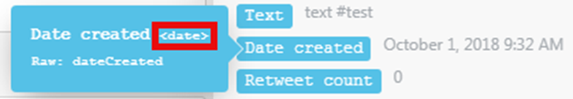
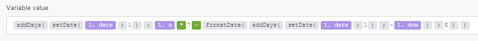
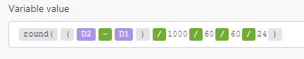
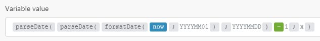

# Funzioni di data e ora

## Variabili

### now

Ottiene l&#39;ora corrente in formato AAAA-MM-GG-hh:mm:ss.

### timestamp

Ottiene l&#39;ora corrente come marca temporale Unix.

## Funzioni

### [!UICONTROL addSeconds (data; numero)]

Returns a new date as a result of adding a given number of seconds to a date. To subtract seconds, enter a negative number.

>[!BEGINSHADEBOX]

**Esempi:**

* `addSeconds(2016-12-08T15:55:57.536Z;2)`

  Returns 2016-12-08T15:55:59.536Z

* `addSeconds(2016-12-08T15:55:57.536Z;-2)`

  Returns 2016-12-08T15:55:55.536Z

>[!ENDSHADEBOX]

### [!UICONTROL addMinutes (date; number)] {#addminutes-date-number}

Returns a new date as a result of adding a given number of minutes to a date. To subtract minutes, enter a negative number.

>[!BEGINSHADEBOX]

**Esempi:**

* `addMinutes(2016-12-08T15:55:57.536Z;2)`

  Returns 2016-12-08T15:57:57.536Z

* `addMinutes(2016-12-08T15:55:57.536Z;-2)`

  Returns 2016-12-08T15:53:57.536Z

>[!ENDSHADEBOX]

### [!UICONTROL addHours (date; number)] {#addhours-date-number}

Restituisce una nuova data in seguito all’aggiunta di un determinato numero di ore a una data. Per sottrarre le ore, immettere un numero negativo.

>[!BEGINSHADEBOX]

**Esempi:**

* `addHours(2016-12-08T15:55:57.536Z; 2)`

  Restituisce 2016-12-08T17:55:57.536Z

* `addHours(2016-12-08T15:55:57.536Z;-2)`

  Restituisce 2016-12-08T13:55:57.536Z

>[!ENDSHADEBOX]

### [!UICONTROL addDays (data; numero)] {#adddays-date-number}

Restituisce una nuova data come risultato dell’aggiunta di un numero specificato di giorni a una data. Per sottrarre i giorni, immettere un numero negativo.

>[!BEGINSHADEBOX]

**Esempi:**

* `addDays(2016-12-08T15:55:57.536Z;2)`

  Restituisce 2016-12-10T15:55:57.536Z

* `addDays(2016-12-08T15:55:57.536Z;-2)`

  Restituisce 2016-12-6T15:55:57.536Z

>[!ENDSHADEBOX]

### [!UICONTROL addMonths (data; numero)]

Restituisce una nuova data in seguito all’aggiunta di un numero specificato di mesi a una data. Per sottrarre i mesi, immettere un numero negativo.

>[!BEGINSHADEBOX]

**Esempi:**

* `addMonths(2016-08-08T15:55:57.536Z;2)`

  Restituisce 2016-10-08T15:55:57.536Z

* `addMonths(2016-08-08T15:55:57.536Z;-2)`

  Restituisce 2016-06-08T15:55:57.536Z

>[!ENDSHADEBOX]

### [!UICONTROL addYears (data; numero)]

Restituisce una nuova data risultante dall&#39;aggiunta di un numero specificato di anni a una data. Per sottrarre gli anni, immettere un numero negativo.

>[!BEGINSHADEBOX]

**Esempi:**

* `addYears(2016-08-08T15:55:57.536Z;2)`

  Restituisce 2018-08-08T15:55:57.536Z

* `addYears(2016-12-08T15:55:57.536Z; -2)`

  Restituisce 2014-08-08T15:55:57.536Z

>[!ENDSHADEBOX]

### [!UICONTROL setSecond (date; number)]

This function returns a new date with the seconds specified in parameters.

Specify a number from 0 to 59. If the number is outside of that range, the function returns a second from the previous minute (for a negative number) or subsequent minute (for a positive number).

If you need to specify a number outside the range, we recommend that you use[!UICONTROL  addSeconds], as described above in the section [addSeconds (date; number)](#addseconds-date-number).

>[!BEGINSHADEBOX]

**Esempi:**

* `setSecond(2015-10-07T11:36:39.138Z;10)`

  Returns 2015-10-07T11:36:10.138Z

* `setSecond(2015-10-07T11:36:39.138Z; 61)`

  Returns 2015-10-07T11:37:01.138Z

>[!ENDSHADEBOX]

### [!UICONTROL setMinute (data; numero)]

Questa funzione restituisce una nuova data con i minuti specificati nei parametri.

Specify a number from 0 to 59. Se il numero non rientra nell’intervallo, la funzione restituisce un minuto dall’ora precedente (per un numero negativo) o dall’ora successiva (per un numero positivo).

If you need to specify a number outside the range, we recommend that you use addMinutes, as described above in [addMinutes (date; number)](#addminutes-date-number).

>[!BEGINSHADEBOX]

**Esempi:**

* `setMinute(2015-10-07T11:36:39.138Z;10)`

  Restituisce 2015-10-07T11:10:39.138Z

* `setMinute(2015-10-07T11:36:39.138Z;61)`

  Restituisce 2015-10-07T12:01:39.138Z

>[!ENDSHADEBOX]

### [!UICONTROL setHour (data; numero)]

Questa funzione restituisce una nuova data con l’ora specificata nei parametri.

Specificare un numero compreso tra 0 e 23. Se il numero non rientra in questo intervallo, la funzione restituisce un’ora dal giorno precedente (per un numero negativo) o dal giorno successivo (per un numero positivo).

Se è necessario specificare un numero non compreso nell&#39;intervallo, è consigliabile utilizzare addHours, come descritto in precedenza in [addHours (date; number)](#addhours-date-number).

>[!BEGINSHADEBOX]

**Esempi:**

* `setHour(2015-08-07T11:36:39.138Z;6)`

  Restituisce 2015-08-07T06:36:39.138Z

* `setHour(2015-08-07T11:36:39.138;-6)`

  Restituisce 2015-08-06T18:36:39.138Z

>[!ENDSHADEBOX]

### [!UICONTROL setDay (data; numero/nome del giorno in inglese)]

Questa funzione restituisce una nuova data con il giorno specificato nei parametri.

È possibile utilizzare questa funzione per impostare il giorno della settimana, con domenica 1 e sabato 7. Se specifichi un numero compreso tra 1 e 7, la data risultante rientra nella settimana corrente (da domenica a sabato). Se il numero non è compreso nell&#39;intervallo, la funzione restituisce un giorno della settimana precedente (per un numero negativo) o della settimana successiva (per un numero positivo).

Se è necessario specificare un numero non compreso nell&#39;intervallo, è consigliabile utilizzare addDays, come descritto in precedenza in [addDays (date; number)](#adddays-date-number).

>[!BEGINSHADEBOX]

**Esempi:**

* `setDay(2018-06-27T11:36:39.138Z;Monday)`

  Returns 2018-06-25T11:36:39.138Z

* `setDay(2018-06-27T11:36:39.138Z;1)`

  Returns 2018-06-24T11:36:39.138Z

* `setDay(2018-06-27T11:36:39.138Z;7)`

  Returns 2018-06-30T11:36:39.138Z

>[!ENDSHADEBOX]

### [!UICONTROL setDate (date; number)]

This function returns a new date with the day of the month specified in parameters.

Specify a number from 1 to 31. If the number is outside of this range, the function returns a day from the previous month (for a negative number) or subsequent month (for a positive number).

>[!BEGINSHADEBOX]

**Esempi:**

* `setDate(2015-08-07T11:36:39.138Z;5)`

  Returns 2015-08-05T11:36:39.138Z

* `setDate(2015-08-07T11:36:39.138Z;32)`

  Returns 2015-09-01T11:36:39.138Z

>[!ENDSHADEBOX]

### [!UICONTROL setMonth (date; number/name of the month in English)]

This function returns a new date with the month specified in parameters.

Specifica un numero compreso tra 1 e 12. Se il numero non rientra in questo intervallo, la funzione restituisce il mese dell’anno precedente (per un numero negativo) o dell’anno successivo (per un numero positivo).

>[!BEGINSHADEBOX]

**Esempi:**

* `setMonth(2015-08-07T11:36:39.138Z;5)`

  Restituisce 2015-05-07T11:36:39.138Z

* `setMonth(2015-08-07T11:36:39.138Z;17)`

  Restituisce 2016-05-07T11:36:39.138Z

* `setMonth(2015-08-07T11:36:39.138Z;january)`

  Restituisce 2015-01-07T12:36:39.138Z

>[!ENDSHADEBOX]

### [!UICONTROL setYear (data; numero)]

Restituisce una nuova data con l’anno specificato nei parametri.

>[!BEGINSHADEBOX]

**Esempio:**

* `setYear(2015-08-07T11:36:39.138Z;2017)`

  Restituisce 2017-08-07T11:36:39.138Z

>[!ENDSHADEBOX]

### [!UICONTROL formatDate (date; format; [timezone])]

Utilizzare questa funzione quando si dispone di un valore Data, ad esempio `12-10-2021 20:30`, che si desidera formattare come valore Testo, ad esempio `Dec 10, 2021 8:30 PM`.

Questo è utile, ad esempio, quando devi modificare il formato della data di un’app o di un servizio web con quello di un’app o di un servizio web connesso nello stesso scenario.

Per ulteriori informazioni, vedere Date and Text nell&#39;articolo [Tipi di dati elemento](/help/workfront-fusion/references/mapping-panel/data-types/item-data-types.md).

#### Parametri

<table style="table-layout:auto"> 
 <col> 
 <col> 
 <col> 
 <thead> 
  <tr> 
   <th>Parametro</th> 
   <th>Tipo di dati previsto* </th> 
   <th>Funzionamento</th> 
  </tr> 
 </thead> 
 <tbody> 
  <tr> 
   <td>[!UICONTROL date] </td> 
   <td>Data </td> 
   <td> <p>Converts a Date value to a Text value. </p> </td> 
  </tr> 
  <tr> 
   <td>[!UICONTROL format] </td> 
   <td>Testo </td> 
   <td> <p>Lets you specify a format using date/time formatting tokens. For more information, see <a href="/help/workfront-fusion/references/mapping-panel/functions/tokens-for-date-and-time-formatting.md" class="MCXref xref">Tokens for date and time formatting</a>.</p> <p class="example" data-mc-autonum="<b>Example: </b>"><span class="autonumber"><span><b>Example: </b></span></span><code>DD.MM.YYYY HH:mm</code> </p> </td> 
  </tr> 
  <tr> 
   <td>[!UICONTROL timezone] </td> 
   <td>Testo </td> 
   <td> <p>(Facoltativo) Consente di specificare il fuso orario utilizzato per la conversione. </p> <p>Per l'elenco dei fusi orari riconosciuti, vedere la colonna "Nome database TZ" in Wikipedia <a href="https://en.wikipedia.org/wiki/List_of_tz_database_time_zones">Elenco dei fusi orari del database tz</a>. Solo i valori elencati in questa colonna vengono riconosciuti dalla funzione come fuso orario valido. Qualsiasi altro valore viene ignorato e viene utilizzato il fuso orario Scenarios specificato nel profilo. </p> <p>Se si omette questo parametro, viene applicato il fuso orario Scenarios specificato nelle impostazioni del profilo. </p> <p class="example" data-mc-autonum="<b>Example: </b>"><span class="autonumber"><span><b>Esempio: </b></span></span><code>Europe/Prague</code>, <code>UTC</code></p> </td> 
  </tr> 
 </tbody> 
</table>

Se viene fornito un tipo diverso, viene applicata la coercizione del tipo. Per ulteriori informazioni, vedere [Tipo di coercizione](/help/workfront-fusion/references/mapping-panel/data-types/type-coercion.md).

#### Valore e tipo restituiti

La funzione `formatDate` restituisce una rappresentazione testuale del valore Data specificato in base al formato e al fuso orario specificati. Il tipo di dati è Testo.

>[!BEGINSHADEBOX]

**Esempi:** In questi esempi, il fuso orario Scenario e Web sono entrambi impostati su `Europe/Prague`.



* `formatDate(1. Date created;MM/DD/YYYY)`

  Restituisce 10/01/2018

* `formatDate(1. Date created; YYYY-MM-DD hh:mm A)`

  Restituisce 2018-10-01 09:32 AM

* `formatDate(1. Date created;DD.MM.YYYY HH:mm;UTC)`

  Restituisce 01.10.2018 07:32

* `formatDate(now;DD.MM.YYYY HH:mm)`

  Restituisce 19.03.2019 15:30

>[!ENDSHADEBOX]

### [!UICONTROL parseDate (testo; formato; [fuso orario])]

Utilizzare questa funzione quando si dispone di un valore Text che rappresenta una data (ad esempio `12-10-2019 20:30` o `Aug 18, 2019 10:00 AM`) e si desidera convertirlo (analizzarlo) in un valore Date (una rappresentazione leggibile da un computer binario). Per ulteriori informazioni, vedere Date and Text nell&#39;articolo [Tipi di dati elemento](/help/workfront-fusion/references/mapping-panel/data-types/item-data-types.md).

#### Parametri

La seconda colonna indica il tipo previsto. Se viene fornito un tipo diverso, viene applicata la coercizione del tipo. Per ulteriori informazioni, vedere [Tipo di coercizione](/help/workfront-fusion/references/mapping-panel/data-types/type-coercion.md).

<table style="table-layout:auto"> 
 <col> 
 <col> 
 <col> 
 <thead> 
  <tr> 
   <th>Parametro</th> 
   <th>Tipo di dati previsto* </th> 
   <th>Funzionamento</th> 
  </tr> 
 </thead> 
 <tbody> 
  <tr> 
   <td>[!UICONTROL text] </td> 
   <td>Testo </td> 
   <td> <p>Converts a Date value to a Text value. </p> </td> 
  </tr> 
  <tr> 
   <td>[!UICONTROL format] </td> 
   <td>Testo </td> 
   <td> <p>Lets you specify a format using date/time formatting tokens. For more information, see <a href="/help/workfront-fusion/references/mapping-panel/functions/tokens-for-date-and-time-formatting.md" class="MCXref xref">Tokens for date and time formatting</a>.</p> <p class="example" data-mc-autonum="<b>Example: </b>"><span class="autonumber"><span><b>Example: </b></span></span><code>DD.MM.YYYY HH:mm</code> </p> </td> 
  </tr> 
  <tr> 
   <td>[!UICONTROL timezone] </td> 
   <td>Testo </td> 
   <td> <p>(Facoltativo) Consente di specificare il fuso orario utilizzato per la conversione. </p> <p>Per l'elenco dei fusi orari riconosciuti, vedere la colonna "Nome database TZ" in Wikipedia <a href="https://en.wikipedia.org/wiki/List_of_tz_database_time_zones">Elenco dei fusi orari del database tz</a>. Solo i valori elencati in questa colonna vengono riconosciuti dalla funzione come fuso orario valido. Qualsiasi altro valore viene ignorato e viene utilizzato il fuso orario Scenarios specificato nel profilo. </p> <p>Se si omette questo parametro, viene applicato il fuso orario Scenarios specificato nelle impostazioni del profilo.</p> <p class="example" data-mc-autonum="<b>Example: </b>"><span class="autonumber"><span><b>Esempio: </b></span></span><code>Europe/Prague</code>, <code>UTC</code></p> </td> 
  </tr> 
 </tbody> 
</table>

Se viene fornito un tipo diverso, viene applicata la coercizione del tipo. Per ulteriori informazioni, vedere [Tipo di coercizione](/help/workfront-fusion/references/mapping-panel/data-types/type-coercion.md).

#### Valore e tipo restituiti

This function converts a text string to a date, according to the format and timezone that you specify. The data type of the value is Date.

>[!BEGINSHADEBOX]

**Examples:** In the following examples, the returned Date value is expressed according to ISO 8601, but the data type of the result is Date.

* `parseDate(2016-12-28;YYYY-MM-DD)`

  Returns 2016-12-28T00:00:00.000Z

* `parseDate(2016-12-28 16:03;YYYY-MM-DD HH:mm)`

  Returns 2016-12-28T16:03:00.000Z

* `parseDate(2016-12-28 04:03 pm; YYYY-MM-DD hh:mm a)`

  Returns 2016-12-28T16:03:06.000Z

* `parseDate(1482940986;X)`

  Returns 2016-12-28T16:03:06.000Z

>[!ENDSHADEBOX]

### [!UICONTROL dateDifference (Date1; Date2; Unit)]

Returns a number representing the difference in the two dates, expressed in the specified unit.

Date2 is subtracted from Date1.

Use one of the following time values for the `unit` parameter:

* milliseconds
* secondi
* minuti
* ore
* giorni
* settimane
* mesi

If no unit is specified, the function returns the difference in milliseconds.

>[!BEGINSHADEBOX]

**Esempi:**

* `dateDifference(2021-05-11T18:10:00.000Z;2021-05-11T18:00:00.000Z)`

  Restituisce `600,000`

* `dateDifference(2021-05-11T18:10:00.000Z;2021-05-11T18:00:00.000Z;hours)`

  Restituisce `4`

* `dateDifference2021-06-11T18:10:00.000Z;2021-05-11T18:00:00.000Z;months)`

  Restituisce `1`

>[!ENDSHADEBOX]

### Altri esempi

#### Come calcolare l’n-esimo giorno della settimana nel mese

Questa sezione è stata adattata per Workfront Fusion dalla pagina Web [!DNL Exceljet] che spiega come ottenere l&#39;ennesimo giorno della settimana in un mese.

Per calcolare una data corrispondente all&#39;ennesimo giorno della settimana del mese, ad esempio primo martedì, terzo venerdì e così via, è possibile utilizzare la formula seguente:



```
{{addDays(setDate(1.date; 1); 1.n * 7 - formatDate(addDays(setDate(1.date; 1); "-" + 1.dow); "E"))}}
```

La formula contiene i seguenti elementi:

<table style="table-layout:auto"> 
 <col> 
 <col> 
 <tbody> 
  <tr> 
   <td><code>1.n</code> </td> 
   <td> <p> Giorno n:</p> 
    <ul> 
     <li><code>1</code> per il 1° martedì</li> 
     <li><code>2</code> per il 2° martedì</li> 
     <li><code>3</code> per il 3° martedì e così via</li> 
    </ul> </td> 
  </tr> 
  <tr> 
   <td><code>2.dow</code> </td> 
   <td> <p> giorno della settimana:</p> 
    <ul> 
     <li><code>1</code> for Monday</li> 
     <li><code>2</code> per martedì</li> 
     <li><code>3</code> per mercoledì</li> 
     <li><code>4</code> per giovedì</li> 
     <li><code>5</code> per venerdì</li> 
     <li><code>6</code> per sabato</li> 
     <li><code>7</code> per domenica</li> 
    </ul> </td> 
  </tr> 
  <tr> 
   <td><code>1.date</code> </td> 
   <td> <p> The date determines the month. To calculate n-th day of week in current month use the <code>now</code> variable.</p> </td> 
  </tr> 
 </tbody> 
</table>

In case you want to calculate only one specific case, for example, every second Wednesday, you can replace the items `1.n` and `2.dow` in the formula with corresponding numbers. For the second Wednesday in the current month, you would use the following values:

* `1.n` = `2`
* `1.dow` = `3`
* `1.date` = `now`


#### Explanation:

* `setDate(now;1)` returns first of current month
* `formatDate(....;E)` returns day of week (1, 2, ... 6)

### How to calculate days between dates

One possibility is to employ the following expression:



```
{{round((2.value - 1.value) / 1000 / 60 / 60 / 24)}}
```

>[!NOTE]
>
>* Values of `D1`and `D2` have be Date type values. If they are String type values (for example, 20.10.2018), use the `parseDate()` function to convert them to Date type values.
>
>* The `round()` function is used for cases when one of the dates falls within the daylight savings time period and the other does not. In these cases, the difference in hours is one hour less or more. You can divide it by 24 for a non-integer result. You lose an hour-Daylight Savings. Round flattens it so you don&#39;t have a percentage

#### How to calculate last day/millisecond of month

When you specify a date range, for example in a search module, if the range spans the whole previous month as a closed interval (the interval that includes both its limit points), you need to calculate the last day of the month.

2019-09-01 ≤ D ≤ 2019-09-30

The formula below shows one way how to calculate last day of the previous month:


```
{{addDays(setDate(now; 1); -1)}}
```

In some cases, you need to calculate not only the last day of month, but literally its last millisecond:

2019-09-01T00:00:00.000Z ≤ D ≤ 2019-09-30T23:59:59.999Z

This formula shows one way how to calculate last millisecond of the previous month:


```
{{parseDate(parseDate(formatDate(now; "YYYYMM01"); "YYYYMMDD"; "UTC") - 1; "x")}}
```

If you need the result to use your timezone setting, omit the UTC argument:



`{{parseDate(parseDate(formatDate(now; "YYYYMM01"); "YYYYMMDD") - 1; "x")}}`

However, it is preferable to use half-open interval instead (the interval that excludes one of its limit points), specifying the first day of the following month instead and replacing the &quot;less or equal than&quot; operator with &quot;less than&quot; as follows:

`2019-09-01 ≤ D < 2019-10-01`

`2019-09-01T00:00:00.000Z ≤ D < 2019-10-01T00:00:00.000Z`
