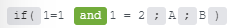

# Funzioni generali

## Variabili

Puoi utilizzare queste variabili generali per identificare i dettagli di un’esecuzione:

* `executionID`: ID dell&#39;esecuzione dello scenario
* `triggerTimestamp`: ora in cui è stata attivata l&#39;esecuzione
* `scenarioID`: ID dello scenario attualmente aperto
* `operationsConsumed`: numero di operazioni utilizzate in quel punto dello scenario.

## [!UICONTROL get (oggetto o array; percorso)]

Restituisce il percorso del valore di un oggetto o di una matrice. Per accedere agli oggetti nidificati, utilizzare la notazione del punto. Il primo elemento di un array è l&#39;indice 1.

>[!BEGINSHADEBOX]

**Esempi:**

* `get( array ; 1 + 1 )`
* `get( array ; 5.raw_name )`
* `get( object ; raw_name )`
* `get( object ; raw_name.sub_raw_name )`

>[!ENDSHADEBOX]

## [!UICONTROL if (espressione; valore1; valore2)]

Restituisce `value1` se l&#39;espressione viene valutata come true, altrimenti restituisce `value2`.

Per creare un&#39;istruzione if che restituisca un valore solo se due o più espressioni vengono valutate come true, utilizzare la parola chiave `and`.

Per combinare `if` istruzioni, utilizzare gli operatori `and` e `or`.

>[!BEGINSHADEBOX]

**Esempi:**

* `if( 1 = 1 ; A ; B )`

  Restituisce Un

* `if( 1 = 2 ; A ; B )`

  Restituisce B

* `if( 1 = 2 and 1 = 2 ; A ; B )`

  Restituisce B

>[!ENDSHADEBOX]

## [!UICONTROL ifempty (valore1; valore2)]

Restituisce `value1` se questo valore non è vuoto, altrimenti restituisce `value2`.

>[!BEGINSHADEBOX]

**Esempi:**

* `ifempty(` `A` `;` `B` )

  Restituisce Un

* `ifempty(` `unknown` `;` `B` )

  Restituisce B

* `ifempty(` `""` `;` `B` )

  Restituisce B

>[!ENDSHADEBOX]

## [!UICONTROL opzione (espressione; valore1; risultato1; [valore2; risultato2; ...]; [altro])]

Valuta un valore (denominato espressione) rispetto a un elenco di valori; restituisce il risultato corrispondente al primo valore corrispondente. Per includere un valore `else`, aggiungerlo dopo l&#39;espressione o il valore finale.

>[!BEGINSHADEBOX]

**Esempi:**

* `switch( B ; A ; 1 ; B ; 2 ; C ; 3 )`

  Restituisce 2

* `switch( C ; A ; 1 ; B ; 2 ; C ; 3 )`

  Restituisce 3

* `switch( X ; A ; 1 ; B ; 2 ; C ; 3 ; 4 )`

  Restituisce 4

  In questa funzione, 4 è il valore da restituire se non viene applicata alcuna espressione (il valore `else`).

>[!ENDSHADEBOX]

## [!UICONTROL omit(object; key1; [key2; ...])]

Omette le chiavi specificate dell&#39;oggetto e restituisce il resto.

>[!BEGINSHADEBOX]

**Esempio:**

`omit(` Utente `;` password `)`

Restituisce una raccolta delle informazioni dell&#39;utente, esclusa la password.

>[!ENDSHADEBOX]

## [!UICONTROL scegli(oggetto; chiave1; [chiave2; ...])]

Seleziona dall’oggetto solo le chiavi specificate.

>[!BEGINSHADEBOX]

**Esempio:**

`pick(` Utente `;` password `;` e-mail `)`

Restituisce una raccolta contenente solo la password e l&#39;indirizzo e-mail dell&#39;utente.

>[!ENDSHADEBOX]

## mergeCollections(collection1; collection2)

Unisce due raccolte combinando le rispettive coppie chiave-valore. Se entrambi gli insiemi contengono la stessa chiave, il valore della seconda raccolta sovrascrive quello della prima raccolta.
