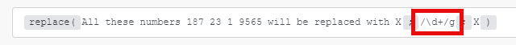
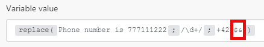

# Funzioni stringa

## [!UICONTROL length (text or buffer)]

Restituisce la lunghezza della stringa di testo (numero di caratteri) o del buffer binario (dimensione del buffer in byte).

>[!BEGINSHADEBOX]

**Esempio:**

`length( hello )`

Restituisce: 5

>[!ENDSHADEBOX]

## [!UICONTROL lower (text)]

Converte tutti i caratteri alfabetici di una stringa di testo in minuscolo.

>[!BEGINSHADEBOX]

**Esempio:**

`lower( Hello )`

Restituisce: hello

>[!ENDSHADEBOX]

## [!UICONTROL capitalize (text)]

Converte il primo carattere di una stringa di testo in maiuscolo.

>[!BEGINSHADEBOX]

**Esempio:**

`capitalize( workfront )`

Restituisce: [!DNL Workfront]

>[!ENDSHADEBOX]

## [!UICONTROL startcase (text)]

Usa la maiuscola per la prima lettera di ogni parola e le minuscole per tutte le altre lettere.

>[!BEGINSHADEBOX]

**Esempio:**
`startcase( hello WORLD )`

Restituisce: [!UICONTROL Hello World]

>[!ENDSHADEBOX]

## [!UICONTROL ascii (text; [remove diacritics])]

Rimuove tutti i caratteri non ascii da una stringa di testo.

>[!BEGINSHADEBOX]

**Esempi:**

* `ascii(` `Wěošrčkřfžrýoáníté` `)`

Restituisce: [!DNL Workfront]

* `ascii(` `ěščřž` `;` `true` `)`

Restituisce: [!UICONTROL escrz]

>[!ENDSHADEBOX]

## [!UICONTROL replace (text;search string; replacement string)]

sostituisce la stringa di ricerca con la nuova stringa.

>[!BEGINSHADEBOX]

**Esempio:**

`replace( Hello World ; Hello ; Hi )`

Restituisce: [!UICONTROL Hi World]

>[!ENDSHADEBOX]

Le espressioni regolari (racchiuse in `/.../`) possono essere utilizzate come stringa di ricerca con una combinazione di flag (ad esempio `g`, `i`, `m`) aggiunti:

>[!BEGINSHADEBOX]

**Esempio:**

Tutti questi numeri X X X X sono sostituiti da X

>[!ENDSHADEBOX]

La stringa di sostituzione può includere i seguenti modelli di sostituzione speciali:

* `$&` Inserisce la sottostringa corrispondente.
* `$n` Dove n è un numero intero positivo minore di 100, inserisce l&#39;ennesima stringa tra parentesi. È indicizzato 1.

>[!BEGINSHADEBOX]

**Esempi:**

Restituisce: numero di telefono `+420777111222`

Restituisce: numero di telefono: `+420777111222`

>[!CAUTION]
>
>Non utilizzare gruppi di acquisizione denominati come `/ is (?<number>\d+)/` nell&#39;argomento della stringa di sostituzione. In questo caso si verifica un errore.

>[!ENDSHADEBOX]

Per ulteriori informazioni sulle espressioni regolari, vedere [Parser di testo](/help/workfront-fusion/references/apps-and-modules/tools-and-transformers/text-parser.md).

## [!UICONTROL trim (text)]

Rimuove gli spazi all&#39;inizio o alla fine del testo.

## [!UICONTROL upper (text)]

Converte tutti i caratteri alfabetici in maiuscolo in una stringa di testo.

>[!BEGINSHADEBOX]

**Esempio:**

`upper( Hello )`

Restituisce: [!UICONTROL HELLO]

>[!ENDSHADEBOX]

## [!UICONTROL substring (text; start;end)]

Restituisce una parte di una stringa di testo tra la posizione &quot;start&quot; e la posizione &quot;end&quot;.

>[!BEGINSHADEBOX]

**Esempi:**

* `substring( Hello ; 0 ; 3)`

  Restituisce: Hel

* `substring( Hello ; 1 ; 3 )`

  Restituisce: el

>[!ENDSHADEBOX]

## [!DNL indexOf (string; value; [start])]

Restituisce la posizione della prima occorrenza di un valore specificato in una stringa. Questo metodo restituisce &#39;-1&#39; se il valore ricercato non è presente. Il valore iniziale indica la posizione nella stringa da cui deve iniziare la ricerca.

>[!BEGINSHADEBOX]

**Esempi:**

* `indexOf( Workfront ; o )`

  Restituisce: 1

* `indexOf( Workfront ; x )`

  Restituisce: -1

* `indexOf( Workfront ; o ; 3 )`

  Restituisce: 6

>[!ENDSHADEBOX]

## [!UICONTROL toBinary (value)]

Converte qualsiasi valore in dati binari.

È inoltre possibile specificare la codifica come secondo argomento per applicare le conversioni binarie da hex o base64 ai dati binari.

>[!BEGINSHADEBOX]

**Esempi:**

* `toBinary( Workfront )`

  Restituisce: 57 6f 72 6b 66 72 6f 6e 74

* `toBinary( V29ya2Zyb250 ; base64 )`

  Restituisce: 57 6f 72 6b 66 72 6f 6e 74

>[!ENDSHADEBOX]

## [!UICONTROL toString (value)]

Converte qualsiasi valore in una stringa.

## [!UICONTROL encodeURL (text)]

Codifica i caratteri speciali in un testo in un indirizzo URL valido.

## [!UICONTROL decodeURL (text)]

Decodifica caratteri speciali in un URL in testo.

>[!BEGINSHADEBOX]

**Esempio:**
`decodeURL( Automate%20your%20workflow )`

Restituisce: [!UICONTROL Automate your workflow]

>[!ENDSHADEBOX]

## [!UICONTROL escapeHTML (text)]

Esclude tutti i tag HTML nel testo.

>[!BEGINSHADEBOX]

**Esempio:**

`escapeHTML( <b>Hello</b> )`

Restituisce: `&lt;b&gt;Hello&lt;/b&gt;`

>[!ENDSHADEBOX]

## [!UICONTROL escapeMarkdown(text)]

Evita tutti i tag Markdown nel testo.

>[!BEGINSHADEBOX]

**Esempio:**

`escapeMarkdown( # Header )`

Restituisce: `&#35; Header`

>[!ENDSHADEBOX]

## [!UICONTROL stripHTML (text)]

Rimuove tutti i tag HTML dal testo.

>[!BEGINSHADEBOX]

**Esempio:**

`stripHTML( <b>Hello</b> )`

Restituisce: Hello

>[!ENDSHADEBOX]

## contiene (testo; stringa di ricerca)

Verifica se il testo contiene la stringa di ricerca.

>[!BEGINSHADEBOX]

**Esempi:**

* `contains( Hello World ; Hello )`

  Restituisce: [!UICONTROL true]

* `contains( Hello World ; Bye )`

  Restituisce: [!UICONTROL false]

>[!ENDSHADEBOX]

## [!UICONTROL split (text; separator)]

Divide una stringa in una matrice di stringhe separandola in sottostringhe.

>[!BEGINSHADEBOX]

**Esempio:**

`split( John, George, Paul ; , )`

>[!ENDSHADEBOX]

## [!UICONTROL md5 (text)]

Calcola l’hash MD5 di una stringa.

>[!BEGINSHADEBOX]

**Esempio:**

`md5( Workfront )`

Restituisce: `1448bbbeaa7a9b8091d426999f1f666b`

>[!ENDSHADEBOX]

## [!UICONTROL sha1 (text; [encoding]; [key])]

Calcola l’hash sha1 di una stringa. Se l&#39;argomento chiave è specificato, viene restituito l&#39;hash HMAC sha1. Codifiche supportate: &quot;hex&quot; (impostazione predefinita), &quot;base64&quot; o &quot;latin1&quot;.

>[!BEGINSHADEBOX]

**Esempio:**

`sha1( workfront )`

Restituisce: b2b30b8ae1f9e5b40fbb0696eaabdbfd8d0c087f

>[!ENDSHADEBOX]

## [!UICONTROL sha256 (text; [encoding]; [key])]

Calcola l’hash sha256 di una stringa. Se l&#39;argomento chiave è specificato, viene restituito l&#39;hash sha256 HMAC. Codifiche supportate: &quot;hex&quot; (impostazione predefinita), &quot;base64&quot; o &quot;latin1&quot;.>

>[!BEGINSHADEBOX]

**Esempio:**

`sha256( workfront )`

Restituisce: ed3d7397eec7b94453035b67ba4468c883ee3bedeb57137f7371f2e0cf5e2bbc

>[!ENDSHADEBOX]

## [!UICONTROL sha512 (text; [output encoding]; [key]; [key encoding])]

Calcola l’hash sha512 di una stringa. Se l&#39;argomento chiave è specificato, viene restituito l&#39;hash HMAC sha512.

Codifiche supportate

* &quot;[!UICONTROL hex]&quot; (impostazione predefinita)
* &quot;[!UICONTROL base64]&quot;
* &quot;[!UICONTROL latin1]&quot;

Codifiche chiave supportate:

* &quot;[!UICONTROL text]&quot; (impostazione predefinita)
* &quot;[!UICONTROL hex]&quot;
* &quot;[!UICONTROL base64]&quot; o &quot;[!UICONTROL binary]&quot;

Quando si utilizza la codifica di chiave &quot;[!UICONTROL binary]&quot;, una chiave deve essere un buffer, non una stringa.

>[!BEGINSHADEBOX]

**Esempio:**

`sha512(workfront)`

Restituisce: 789ae41b9456357e4f27c6a09956a767abbb8d80b206003ffdd1e94dbc687cd119b85e1e19db58bb44b234493af35fd431639c0345aadf2cf7ec26e9f4a7fb19

>[!ENDSHADEBOX]

## [!UICONTROL base64 (text)]

Trasforma il testo in base64.

>[!BEGINSHADEBOX]

**Esempio:**

`base64( workfront )`

Restituisce: d29ya2Zyb250==

>[!ENDSHADEBOX]
