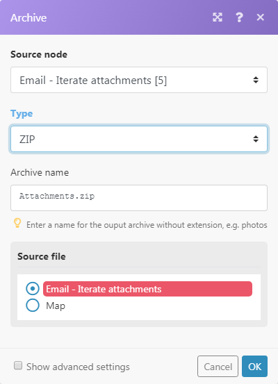

# Modulo [!UICONTROL Aggregator]

Un modulo aggregatore è un modulo che unisce diversi bundle di dati in un singolo bundle.

## Requisiti di accesso

+++ Espandi per visualizzare i requisiti di accesso per la funzionalità in questo articolo.

<table style="table-layout:auto">
 <col> 
 <col> 
 <tbody> 
  <tr> 
   <td role="rowheader">Pacchetto Adobe Workfront</td> 
   <td> 
Qualsiasi pacchetto di flusso di lavoro Adobe Workfront e qualsiasi pacchetto di automazione e integrazione Adobe Workfront

Workfront Ultimate

Pacchetti Workfront Prime e Select, con un ulteriore acquisto di Workfront Fusion.
 </td> 
  </tr> 
  <tr data-mc-conditions=""> 
   <td role="rowheader">Licenze Adobe Workfront</td> 
   <td> 
Standard

Lavoro o superiore
 </td> 
  </tr> 
  <tr> 
   <td role="rowheader">Prodotto</td> 
   <td>
   
Se la tua organizzazione dispone di un pacchetto Select o Prime Workfront che non include l’automazione e l’integrazione di Workfront, deve acquistare Adobe Workfront Fusion.</li></ul>
   </td> 
  </tr>
 </tbody> 
</table>

Per ulteriori dettagli sulle informazioni contenute in questa tabella, vedere [Requisiti di accesso nella documentazione](/help/workfront-fusion/references/licenses-and-roles/access-level-requirements-in-documentation.md).

+++## Panoramica del modulo [!UICONTROL Aggregator]

Durante l&#39;esecuzione di un modulo [!UICONTROL Aggregator], vengono eseguite le seguenti operazioni:

* Accumula tutti i bundle dal funzionamento di un singolo modulo di origine.
* Restituisce un singolo bundle con un array contenente un elemento per bundle accumulato. Il contenuto degli elementi dell&#39;array dipende dal modulo [!UICONTROL Aggregator] e dalla relativa configurazione.

Nell&#39;immagine seguente viene illustrata una configurazione tipica del modulo [!UICONTROL Aggregator]:

<table style="table-layout:auto">
 <col> 
 <col> 
 <tbody> 
  <tr> 
   <td> 
[!UICONTROL Modulo Source]
 </td> 
   <td> 
Il modulo da cui inizia l’aggregazione del bundle. Il modulo sorgente è in genere un iteratore o un modulo di ricerca che produce una serie di bundle.

Quando si imposta il modulo di origine dell'aggregatore (e si chiude la relativa configurazione), il percorso tra il modulo di origine e il modulo dell'aggregatore viene racchiuso in un'area grigia, in modo da visualizzare chiaramente l'inizio e la fine dell'aggregazione. 
   
 
Per ulteriori informazioni sugli iteratori, vedere il modulo <a href="/help/workfront-fusion/references/modules/iterator-module.md" class="MCXref xref">[!UICONTROL Iterator]</a>.
 
   
Per ulteriori informazioni sui moduli di ricerca, vedere <a href="/help/workfront-fusion/get-started-with-fusion/understand-fusion/module-overview.md#search-modules" class="MCXref xref">Moduli di ricerca</a> nella panoramica del modulo.
 </td> 
  </tr> 
  <tr> 
   <td> 
[!UICONTROL Tipo di struttura di destinazione]

(Applicabile solo per il modulo [!UICONTROL Array aggregator].)
 </td> 
   <td> 
 Struttura di destinazione in cui vengono aggregati i dati. L'opzione predefinita, [!UICONTROL Custom], consente di scegliere gli elementi da aggregare nell'elemento <code>Array </code> del bundle di output dell'aggregatore di array :
 
  
 
Dopo aver connesso altri moduli dopo il modulo [!UICONTROL Array aggregator] e essere tornato alla configurazione del modulo aggregatore, il menu a discesa del tipo di struttura [!UICONTROL Target] contiene tutti i moduli seguenti e i relativi campi che sono di tipo "Array of Collections". 
In questo esempio, il campo [!UICONTROL Attachments] del modulo [!DNL Slack] &gt;[!UICONTROL Create a Message] viene visualizzato nel campo Array aggregator &gt; Target structure type. 
 
  
 </td> 
  </tr> 
  <tr> 
   <td>[!UICONTROL Campi aggregati]</td> 
   <td>I campi che si desidera includere nell'output del modulo aggregatore.</td> 
  </tr> 
  <tr> 
   <td> 
[!UICONTROL Raggruppa per]
 </td> 
   <td> 
Utilizzando il campo Raggruppa per è possibile definire un'espressione contenente uno o più elementi mappati. I dati aggregati verranno quindi separati in Gruppi dal valore dell’espressione. Ogni gruppo produce come bundle separato, contenente una Chiave e un array di dati. Raggruppando i risultati, puoi utilizzare la Chiave come filtro nei moduli successivi.

   
Ogni bundle contiene due elementi:
 
    <ul> 
     <li><code>Key</code>: valore in base al quale si esegue il raggruppamento.</li> 
     <li><code>Array</code>: i dati aggregati dai bundle per i quali la formula ha restituito il valore <code>Key</code>.</li> 
    </ul> </td> 
  </tr> 
  <tr> 
   <td> 
Interrompi elaborazione dopo un'aggregazione vuota
 </td> 
   <td> 
Per impostazione predefinita, il modulo [!UICONTROL Aggregator] restituisce il risultato dell'aggregazione anche quando nessun bundle ha raggiunto il modulo [!UICONTROL Aggregator] (ad esempio, perché sono stati tutti filtrati all'esterno del percorso che include l'aggregatore). Se l'opzione [!UICONTROL Interrompe l'elaborazione dopo un'aggregazione vuota] è abilitata, il modulo [!UICONTROL Aggregator] non produce alcun bundle di output se non sono presenti bundle di input. Al contrario, il flusso si interrompe.
 </td> 
  </tr> 
 </tbody> 
</table>

>[!NOTE]
>
>I bundle generati dai moduli tra il modulo di origine e il modulo [!UICONTROL Aggregator] non vengono generati dal modulo [!UICONTROL Aggregator]. Questi bundle non sono accessibili dai moduli nel flusso dopo [!UICONTROL Aggregator]. Se hai bisogno di dati da un bundle generato da un modulo tra il modulo di origine e il modulo [!UICONTROL Aggregator], assicurati di includere l&#39;elemento specificato nella configurazione del modulo [!UICONTROL Aggregator] (ad esempio nel campo [!UICONTROL Aggregated fields] nella configurazione del modulo [!UICONTROL Array aggregator]).

## Scenario di esempio del funzionamento degli aggregatori

Questo scenario di esempio mostra come comprimere tutti gli allegati e-mail e caricare il file ZIP in [!DNL Dropbox].

Lo scenario seguente mostra come:

* Il primo modulo controlla una cassetta postale per le e-mail in arrivo. Il trigger [!UICONTROL E-mail] >[!UICONTROL E-mail di controllo] restituisce un bundle con l&#39;elemento `Attachments[]`, che è un array contenente tutti gli allegati dell&#39;e-mail.

* Il secondo modello esegue l&#39;iterazione degli allegati dell&#39;e-mail: [!UICONTROL E-mail] >[!UICONTROL Itera allegati] L&#39;iteratore prende gli elementi dell&#39;array `Attachments[]` uno per uno e li invia ulteriormente come bundle separati.

* Il terzo modulo è l&#39;aggregatore. Aggrega i bundle generati dal modulo [!UICONTROL Email] >[!UICONTROL Itera allegati]. [!UICONTROL Archivia] >[!UICONTROL Crea un aggregatore di archivi] accumula tutti i bundle che riceve ed restituisce un singolo bundle contenente il file ZIP.

* L&#39;ultimo modulo carica il file ZIP risultante in [!DNL Dropbox].  [!DNL Dropbox] > [!UICONTROL Carica un file] ottiene il file ZIP dal [!UICONTROL Archivio] > [!UICONTROL Crea un archivio] modulo e lo carica in [!DNL Dropbox].

Di seguito è riportato un esempio di configurazione dell&#39;aggregatore [!UICONTROL Archive] > [!UICONTROL Create an archive]:

