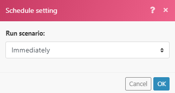

# Trigger istantanei (webhook)

Molti servizi forniscono webhook per inviare notifiche istantanee ogni volta che si verifica un determinato cambiamento (evento) nel servizio. Per elaborare questi eventi, si consiglia di utilizzare trigger istantanei. I trigger istantanei visualizzano il tag `Instant` nell&#39;elenco dei moduli per un determinato connettore.

>[!TIP]
>
>È possibile controllare l&#39;elenco dei moduli in un connettore per verificare se dispone di un trigger immediato oppure controllare la documentazione del connettore in [Applicazioni Fusion e relativi riferimenti ai moduli](/help/workfront-fusion/references/apps-and-modules/apps-and-modules-toc.md).
>
>Per la documentazione sui trigger istantanei di Adobe Workfront, consulta [Triggers](/help/workfront-fusion/references/apps-and-modules/adobe-connectors/workfront-modules.md#triggers) nell&#39;articolo Moduli Workfront.

Se un connettore non include un webhook, puoi effettuare una delle seguenti operazioni:

* Crea un webhook personalizzato utilizzando il modulo Webhook.
Per ulteriori informazioni, vedere [Webhook](/help/workfront-fusion/references/apps-and-modules/universal-connectors/webhooks-updated.md).
* Utilizza i trigger di polling per eseguire periodicamente il polling del servizio.
Per ulteriori informazioni, vedere [Pianificare uno scenario](/help/workfront-fusion/create-scenarios/config-scenarios-settings/schedule-a-scenario.md)

Per un video introduttivo ai webhook in Workfront Fusion, vedi:

* [Introduzione ai webhook](https://video.tv.adobe.com/v/3427025/){target=_blank}
* [Webhook intermedi](https://video.tv.adobe.com/v/3427030/){target=_blank}

## Visualizza dettagli webhook

È possibile visualizzare un elenco di webhook nell&#39;area Webhook.

1. Per aprire l&#39;area dei webhook, fare clic sull&#39;icona dei webhook  nell&#39;area di navigazione a sinistra.

   Qui puoi vedere un elenco di webhook.

   

1. Per cercare un webhook specifico, immettere il termine di ricerca nella casella Cerca.
1. Per copiare un webhook, fare clic sull&#39;icona Copia  accanto all&#39;URL nella riga del webhook.
1. Per disabilitare o abilitare un webhook, disabilitare o abilitare l&#39;interruttore nella colonna Stato nella riga di tale webhook.
1. Per verificare se una coda dei webhook è piena, selezionare la colonna Coda completa. Il numero in questa colonna è il numero di elementi attualmente in coda.
1. Per visualizzare le operazioni gestite da un webhook, fare clic su **Operazioni** nella colonna Coda completa del webhook.
1. Per verificare se un webhook è scaduto, seleziona la colonna Scaduto. I webhook scaduti non sono allegati ad alcuno scenario o non hanno ricevuto eventi per 120 ore.
1. Per visualizzare lo scenario in cui viene utilizzato un webhook, fare clic sul pulsante **Scenario** nella colonna Scenario per tale webhook.
1. Per visualizzare la connessione utilizzata per questo webhook, fare clic sul pulsante **Connessione** nella colonna Connessione relativa a tale webhook.
1. Per nascondere le colonne o mostrare le colonne precedentemente nascoste, fare clic sull&#39;icona **Colonne**  e selezionare o deselezionare i nomi delle colonne.

## Pianificazione dei trigger istantanei

Quando configuri un trigger istantaneo, ti viene richiesto di selezionare quando viene eseguito.

Selezionare `Immediately` per eseguire immediatamente lo scenario quando Workfront Fusion riceve nuovi eventi dal servizio. Questi eventi vengono immediatamente inviati in una coda e quindi elaborati nello scenario uno alla volta, nello stesso ordine in cui vengono ricevuti i dati.

Quando lo scenario viene eseguito, viene conteggiata la quantità totale di eventi in sospeso in attesa nella coda e lo scenario esegue il numero di cicli corrispondente agli eventi in sospeso, elaborando un evento per ciclo.

Per ulteriori informazioni sui cicli, vedere [Esecuzione dello scenario, cicli e fasi](/help/workfront-fusion/references/scenarios/scenario-execution-cycles-phases.md).

>[!NOTE]
>
>* Un ciclo non è lo stesso di un&#39;esecuzione di uno scenario. In un’unica esecuzione dello scenario possono essere presenti più cicli.
>* Quando si esegue uno scenario con un trigger istantaneo pianificato per l&#39;esecuzione di `Immediately`, si applicano le seguenti eccezioni:
>
>     * L&#39;intervallo tra due esecuzioni non è soggetto all&#39;intervallo minimo in base al piano tariffario.
>
>       Ad esempio, una volta che lo scenario termina la sua esecuzione, la coda del webhook viene nuovamente controllata. Se sono presenti webhook in sospeso, lo scenario viene eseguito immediatamente di nuovo, elaborando nuovamente tutti i webhook in sospeso.
>   
>     * L’impostazione dello scenario Numero massimo di cicli viene ignorata e impostata su 100, il che significa che non più di 100 webhook in sospeso verranno elaborati durante un’unica esecuzione dello scenario (alla velocità di 1 evento per ciclo).
>

Se utilizzi un&#39;impostazione di pianificazione diversa da [!UICONTROL Immediatamente], lo scenario viene eseguito agli intervalli specificati. Poiché è possibile raccogliere più webhook nella coda durante l&#39;intervallo, si consiglia di impostare l&#39;opzione [!UICONTROL Numero massimo di cicli] su un valore maggiore del valore predefinito 1 per elaborare più webhook in un&#39;esecuzione dello scenario:

1. Fai clic sull&#39;icona [!UICONTROL Impostazioni scenario]  nella parte inferiore dello scenario.
1. Nel pannello **[!UICONTROL Impostazioni scenario]** visualizzato, immettere un numero nel campo **[!UICONTROL Numero massimo di cicli]** per indicare il numero di eventi dalla coda che si desidera eseguire ogni volta che si esegue lo scenario.

Gli eventi rimanenti nella coda verranno elaborati alla successiva esecuzione dello scenario, fino al numero impostato nel campo Numero massimo di cicli.

## Guardrail per webhook

Per garantire buone prestazioni, Workfront Fusion dispone dei seguenti guardrail per i webhook.

### Limiti di tariffa

L&#39;attuale limite di velocità è di 5 webhook al secondo. Se il limite viene superato, viene restituito un codice di stato `429`.

### Scadenza dei webhook inattivi

Un webhook che non è stato assegnato ad alcuno scenario per più di 120 ore viene rimosso.

### Payload del webhook

Workfront Fusion memorizza i payload del webhook per 30 giorni. Se si accede a un payload del webhook più di 30 giorni dopo la sua creazione, si verifica l&#39;errore [!UICONTROL `Failed to read file from storage.`]

### Gestione degli errori

Quando si verifica un errore nello scenario con un trigger istantaneo, lo scenario:

* Si arresta immediatamente quando lo scenario è impostato per l&#39;esecuzione [!UICONTROL Immediata].
* Si interrompe dopo 3 tentativi non riusciti (3 errori) quando lo scenario viene impostato per l’esecuzione come pianificato.

Se si verifica un errore durante l’esecuzione dello scenario, l’evento viene rimesso in coda durante la fase di rollback dell’attivatore istantaneo. In tale situazione, puoi correggere lo scenario ed eseguirlo nuovamente.

Per ulteriori informazioni, vedere [Rollback](/help/workfront-fusion/references/scenarios/scenario-execution-cycles-phases.md#rollback) nell&#39;articolo Esecuzione scenario, cicli e fasi.

Se nello scenario è presente un modulo di risposta Webhook, l’errore viene inviato alla risposta Webhook. Il modulo di risposta Webhook viene sempre eseguito per ultimo (quando l&#39;opzione [!UICONTROL Conferma automatica] nelle impostazioni dello scenario non è abilitata).

Per ulteriori informazioni, vedere [Risposta ai webhook](/help/workfront-fusion/references/apps-and-modules/universal-connectors/webhooks-updated.md#responding-to-webhooks) nell&#39;articolo Webhook.

### Disattivazione webhook

I webhook vengono disattivati automaticamente se si applica una delle seguenti condizioni:

* Il webhook non è stato connesso ad alcuno scenario per più di 5 giorni.
* Il webhook viene utilizzato solo in scenari inattivi, che sono stati inattivi per più di 30 giorni.

I webhook disattivati vengono eliminati e annullati automaticamente se non sono connessi ad alcun scenario e se sono in stato disattivato da oltre 30 giorni.

## Webhook personalizzati

Puoi creare webhook personalizzati. Per ulteriori informazioni, vedere [Webhook](/help/workfront-fusion/references/apps-and-modules/universal-connectors/webhooks-updated.md).

## Risorse

Per ulteriori informazioni sui cicli, vedere [Esecuzione dello scenario, cicli e fasi](/help/workfront-fusion/references/scenarios/scenario-execution-cycles-phases.md).
