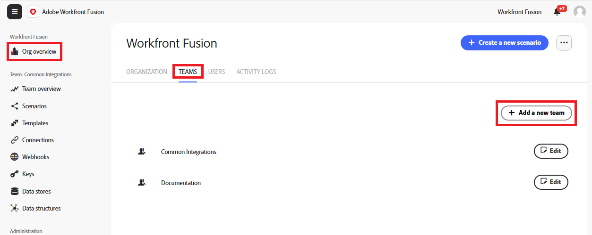

# Creare un team

I team sono gruppi più piccoli all’interno dell’organizzazione e condividono risorse Fusion come scenari, connessioni e modelli. Puoi creare tutti i team che desideri.

Le organizzazioni possono disporre di tutti i team necessari e gli utenti possono appartenere a uno o più team.

>[!NOTE]
>
>Poiché i team condividono le risorse, a volte è utile che un team abbia un solo membro. Ad esempio, gli utenti in formazione possono creare connessioni ai propri account Workfront individuali. Tutti i membri del gruppo possono connettersi al singolo account Workfront. In questo caso, consigliamo che l’utente sia l’unico membro di un team di formazione.

## Requisiti di accesso

+++ Espandi per visualizzare i requisiti di accesso per la funzionalità in questo articolo.

<table style="table-layout:auto">
 <col> 
 <col> 
 <tbody> 
  <tr> 
   <td role="rowheader">Pacchetto Adobe Workfront</td> 
   <td> 
Qualsiasi pacchetto di flusso di lavoro Adobe Workfront e qualsiasi pacchetto di automazione e integrazione Adobe Workfront

Workfront Ultimate

Pacchetti Workfront Prime e Select, con un ulteriore acquisto di Workfront Fusion.
 </td> 
  </tr> 
  <tr data-mc-conditions=""> 
   <td role="rowheader">Licenze Adobe Workfront</td> 
   <td> 
Standard

Lavoro o superiore
 </td> 
  </tr> 
  <tr> 
   <td role="rowheader">Prodotto</td> 
   <td>
   
Se la tua organizzazione dispone di un pacchetto Select o Prime Workfront che non include l’automazione e l’integrazione di Workfront, deve acquistare Adobe Workfront Fusion.</li></ul>
   </td> 
  </tr>
  <tr data-mc-conditions=""> 
   <td role="rowheader">Configurazioni del livello di accesso</td> 
   <td> 
     
Devi essere un amministratore di Workfront Fusion per la tua organizzazione.

     
Devi essere un amministratore di Workfront Fusion per il tuo team.

   </td> 
  </tr> 
 </tbody> 
</table>

Per ulteriori dettagli sulle informazioni contenute in questa tabella, vedere [Requisiti di accesso nella documentazione](/help/workfront-fusion/references/licenses-and-roles/access-level-requirements-in-documentation.md).

+++

## Creare un team

I proprietari e gli amministratori dell’organizzazione possono creare dei team. I team vengono creati aggiungendo un nuovo team a un’organizzazione.

Per creare un team:

1. Nel pannello di navigazione a sinistra, fai clic su **[!UICONTROL Panoramica organizzazione]**
1. Seleziona la scheda **[!UICONTROL Team]**.
1. Fare clic su **[!UICONTROL Aggiungi un nuovo team]**.
   
1. Immettere un nome per il nuovo team e fare clic su **Aggiungi**.

## Modificare un team

È possibile modificare il nome di un team.

1. Nel pannello di navigazione a sinistra, fai clic su **[!UICONTROL Panoramica organizzazione]**
1. Seleziona la scheda **[!UICONTROL Team]**.
1. Individua il team di cui vuoi modificare il nome, quindi fai clic su **Modifica** nella riga per il team.
1. Immetti un nuovo nome per il team, quindi fai clic su **Salva**.

